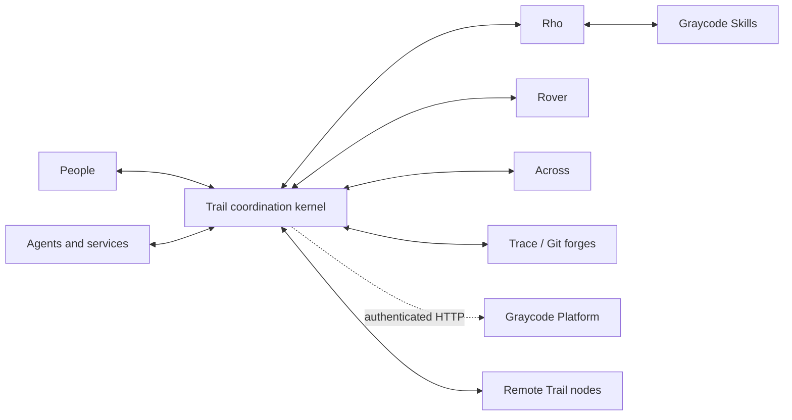
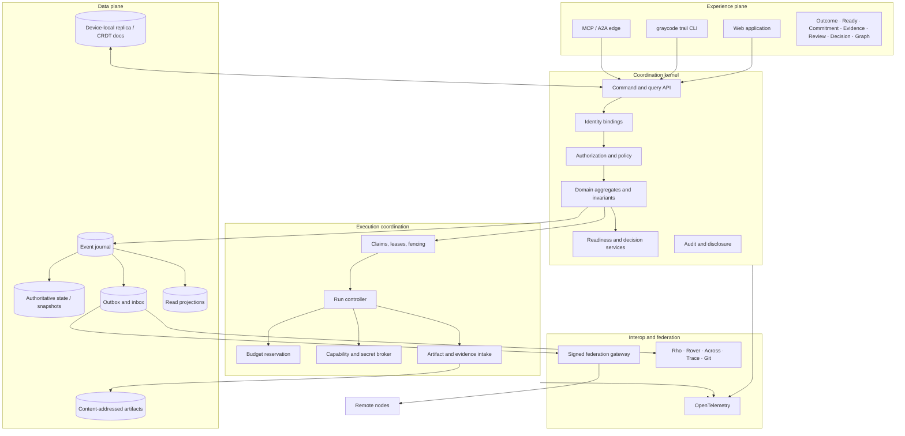
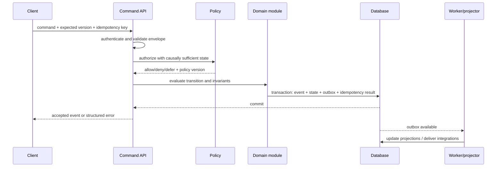
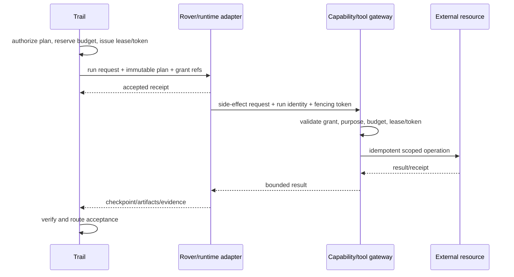

# Trail system architecture

**Status:** proposed target architecture; Phase 0/1 choices remain open  
**Date:** 2026-09-28

## Context



Trail is the coordination authority for its own workspaces. External systems remain authoritative for their objects. Adapters map and reference them.

Trail is an independent GraycodeAI product. The hosted product may use `trail.graycodeai.com`, but the core has its own repository, release, deployment, persistence, identity configuration, public API, and operational lifecycle. Self-hosted Trail does not require a GraycodeAI cloud account. Graycode Platform supplies optional cross-product account and billing integration over versioned HTTP; it does not share Trail's database, queues, internal packages, or authority state.

## Logical planes



## First deployment: modular monolith

The first production shape should be:

```text
one deployable API/kernel
one background worker deployable
one web application
one relational database
one object/artifact store abstraction
optional local SQLite replica
```

Modules maintain explicit internal boundaries but share one transaction domain where correctness benefits. Extract a service only after measured scaling, isolation, deployment, or ownership pressure.

### Candidate module boundaries

- identity and membership;
- policy and capability;
- situation and outcomes;
- commitments and negotiation;
- work/dependency/readiness;
- claims/runs/budgets;
- artifacts/evidence/review/acceptance;
- event journal/projections;
- adapters;
- federation;
- notifications/attention;
- audit/retention.

## Authoritative command path



The same transaction persists the accepted event, authoritative aggregate state or snapshot, idempotency result, and outbox record. Delivery and projections may retry.

## Read path

Ordinary views read projections and include:

- projection cursor/version;
- source freshness;
- authoritative versus external/inferred status;
- disclosure-filtered explanation metadata.

Commands never trust an old projection for a safety invariant. The domain handler reloads causally sufficient authoritative state.

## Storage proposal

### Authoritative relational store

Use PostgreSQL for team/server deployment or SQLite for a deliberately local first milestone, selected by the Phase 0 benchmark. Store:

- event journal;
- aggregate state/snapshots;
- identities and bindings;
- policies and grants;
- leases/fencing and budgets;
- inbox/outbox/idempotency;
- adapter cursors;
- projection checkpoints.

### Graph queries

Start with relational relation tables, recursive CTEs, closure/materialized tables, and background analytical jobs. Add a graph projection only after representative queries fail targets or graph algorithms justify its operational cost.

### Artifact store

Content-addressed manifests point to local filesystem or S3-compatible storage. Encryption, authorization, retention, and availability are separate from the content digest.

### Search

Start with database full-text search where it meets the pilot. A separate search engine is a rebuildable projection and never an authorization authority.

### CRDT documents

Use one selected CRDT only for approved mergeable fields. Store document/update metadata with access policy and compaction/version rules. Domain commands reference document versions or digests when the exact text matters to acceptance.

## Adapter architecture

Each adapter has:

- external authority definition;
- principal and object mapping;
- supported direction: read, propose, or write;
- source cursor and gap reconciliation;
- idempotency and correlation strategy;
- schema/version mapping;
- disclosure classification;
- health and freshness signal;
- retry and dead-letter/quarantine behavior.

Adapters consume published Trail protocol types. They do not import domain persistence or sibling repository internals.

## Agent edge

MCP exposes bounded resources and tools such as:

- read outcome/commitment context;
- list ready work with explanations;
- propose plan/dependency/decision;
- request a claim;
- report checkpoint;
- submit artifact/evidence;
- request review or authority change.

It does not expose SQL, event append, raw credentials, or unrestricted arbitrary mutation.

A2A may transport long-running task status and artifacts. The Trail run/commitment remains the durable semantic record.

## Execution boundary



The gateway is the enforcement point for protected side effects. A lease stored only in a prompt is not a control.

## Federation boundary

Nodes exchange boundary contracts, addressed proposals, accepted events within sender authority, receipts, and selected evidence. They do not replicate full private workspaces by default.

Federation is described in [the distributed systems model](./DISTRIBUTED_SYSTEMS_MODEL.md).

## Deployment profiles

### Local personal

- one device/server;
- local database and filesystem artifact store;
- no mandatory cloud;
- optional read adapters;
- signed export.

### Team self-hosted

- API/web/worker deployables;
- managed PostgreSQL and S3-compatible store;
- OIDC and optional workload identity;
- connectors and bounded execution;
- backup/restore and observability.

### Hosted GraycodeAI

- independent Trail deployment at `trail.graycodeai.com`;
- optional organization, account, and billing integration through versioned Graycode Platform APIs;
- tenant isolation and regional policy;
- hosted runners remain separately identified and sandboxed;
- self-hosted export/exit remains supported.

### Federated

- independently administered nodes;
- explicit peer/trust configuration;
- signed selective exchange;
- no shared super-admin.

## Scalability strategy

Scale in this order:

1. bounded queries, pagination, and incremental projections;
2. worker concurrency with partitioned outbox jobs;
3. read replicas/caches that preserve authorization freshness;
4. partition large analytical projections by workspace/object;
5. isolate federation and connector workloads with quotas;
6. extract services only for demonstrated operational boundaries.

Human review, external APIs, and model/runtime capacity are first-class queues. Increasing agent concurrency without review capacity is a failure mode.

## Observability

Technical telemetry:

- command latency/result;
- event append failures;
- projection lag/rebuild;
- outbox/inbox backlog and retries;
- connector/federation health;
- lease expiry/stale-token rejection;
- run/budget/tool denial;
- artifact/evidence availability;
- policy decision latency and safe reason class.

Product telemetry is aggregate, purpose-bound, and privacy reviewed. Durable audit uses domain events; logs and traces are diagnostic and can expire.

## Recovery priorities

1. prevent unauthorized side effects;
2. preserve accepted event integrity and keys;
3. recover authoritative policy, lease, and budget state;
4. restore artifact/evidence availability;
5. rebuild projections and search;
6. resume connectors/federation with cursor reconciliation;
7. preserve local drafts and pending proposals.

## Architecture tests before implementation commitment

- event append plus outbox crash test;
- deterministic projection rebuild and unknown-event behavior;
- lease/fencing under partition and delayed cancellation;
- policy revocation race;
- artifact digest, removal, and secret scanning;
- CRDT merge versus authority-command boundary;
- connector duplicate/gap/two-way-loop handling;
- federation disclosure/inference test;
- full backup/restore including keys;
- accessible equivalent of graph workflows.
