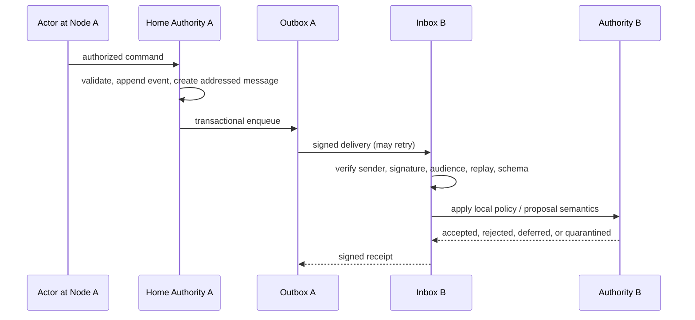

# Distributed systems model

**Status:** proposed  
**Date:** 2026-09-28

## System model

Trail operates across unreliable processes, networks, devices, connectors, and independently administered nodes. The design assumes:

- processes crash and restart;
- messages are delayed, duplicated, reordered, or lost;
- network partitions occur;
- clocks differ and can be wrong;
- clients retry after ambiguous timeouts;
- connectors and external systems have independent consistency models;
- authenticated principals and nodes can still be buggy or malicious;
- artifacts can disappear even when their digests remain;
- schema and policy versions coexist during upgrade;
- some side effects cannot be rolled back.

The baseline does not assume Byzantine global consensus. Each trust domain is authoritative for scoped objects, and other nodes decide whether to trust or accept its signed statements.

## Consistency by operation

| Operation/state | Consistency model | Reason |
|---|---|---|
| personal layout, filter, draft | local/mergeable | no shared safety invariant |
| collaborative description/comment | CRDT eventual convergence | concurrent editing is expected and mergeable |
| additive observations and evidence proposals | monotonic accumulation with provenance | new facts can be added without retracting old ones |
| outcome/commitment amendment | optimistic concurrency at home authority | parties must agree on exact version |
| exclusive claim/lease | linearized at home authority with fencing | at most one valid protected actor |
| capability grant/revocation | authoritative ordered state | stale permission can cause harm |
| budget reservation/spend | serializable/atomic per budget authority | overspend invariant |
| acceptance | authoritative exact-version transition | final judgment cannot be merged blindly |
| search/analytics/graph | eventual rebuildable projection | stale results are tolerable when labeled and not used for safety |
| federation delivery | at least once, signed, idempotent application | networks cannot guarantee exactly once |

## CALM boundary

Coordination-free replication is reserved for monotonic information: facts can accumulate without invalidating a previously correct conclusion.

Examples suitable for merge or append:

- add an observation with provenance;
- attach another artifact reference;
- add a comment;
- add a proposed dependency;
- record a local layout preference.

Examples requiring coordination because they are non-monotonic, scarce, or revocable:

- “only one executor may write this resource”;
- “spend must remain below this budget”;
- “this principal may no longer act”;
- “this exact version is accepted”;
- “two of these three current reviewers approved”;
- “this confidential field may be disclosed.”

The UX must make this boundary visible. An offline authoritative-looking action may be only a pending proposal.

## Ordering and time

### Causal order

Events carry causation and subject version. A full global total order is neither available nor needed. The system preserves a partial order and orders events at an authority where an invariant requires it.

### Logical order

Within an aggregate/home authority, a monotonically increasing version or sequence prevents stale updates. Federation can carry a logical-time token for gap detection, but receivers still use subject version and causal dependencies.

### Wall time

Wall-clock timestamps support display, deadlines, valid-time claims, and audit. They do not choose concurrent winners. Authority-side time defines lease expiry; clients stop early using a safety margin.

### Bitemporal facts

Trail records:

- `validFrom` / `validTo`: when the claim applies in the modeled world;
- `recordedAt`: when Trail accepted the claim;
- event/subject version: accepted order at the authority.

Backdating is an authorized claim, not a rewrite of recorded history.

## Idempotency and delivery

### Commands

Clients supply a stable idempotency key scoped to actor, command kind, and authority. The authority persists the final result with the domain transaction and returns that result on retry.

Changing the payload under the same key is an error. Idempotency records have a documented retention period that exceeds expected retries and offline queues.

### Events and messages

Each event/message has a globally unique ID and digest. Consumers persist an inbox/deduplication result before or with state application. Duplicate delivery returns the existing receipt.

### External side effects

“Exactly once” is not assumed. Each tool/connector contract declares one of:

1. target-native idempotency key;
2. read-before-write reconciliation with a stable external identity;
3. compensating action;
4. irreversible action requiring preauthorization and ambiguous-result human recovery.

A network timeout after sending is `unknown`, never automatically `failed`.

## Transactional outbox and inbox

An accepted command transaction writes:

- authoritative domain event/state;
- idempotency result;
- outbox messages required by accepted state;
- projection checkpoint where synchrony is required.

A relay may publish twice, so downstream application is idempotent. Inbound federation and connector messages use an inbox record with validation/quarantine state.

## Claims, leases, and fencing

For exclusive work, the home authority maintains a counter:

```text
claim(work, holder) -> { token: n, expiresAt }
```

Every newly accepted claim/reassignment increments `n`. Protected resources or the capability gateway reject tokens lower than the latest known token.

Lease rules:

- renewal with the same idempotency key returns the same result;
- an authority may renew only the current holder/token;
- expiration stops new protected actions but does not erase produced local work;
- a partitioned worker checkpoints and waits or produces an untrusted proposal;
- cancellation without fencing is insufficient because the worker may not receive it;
- a shared/nonexclusive activity should not use an exclusive lease.

## Projection model

Events are inputs to versioned projection functions:

```text
projection_vN = fold(events, reducer_vN, initial_vN)
```

Projection rules:

- deterministic for the same ordered aggregate streams and code version;
- checkpointed with event cursor and reducer version;
- rebuildable into a shadow table/index;
- switchable after verification;
- authorized at query time or prefiltered by a proven policy-aware index;
- never an independent mutation source.

External-system snapshots in projections carry source authority, version/cursor, and freshness.

## Local-first model

### Local replica contains

- authorized read projections;
- encrypted user preferences;
- selected CRDT documents/updates;
- pending commands/proposals;
- sync cursors and schema version;
- no long-lived broad agent secrets.

### Reconnect protocol

1. authenticate device and negotiate versions;
2. rotate/refresh narrow credentials;
3. exchange CRDT state/update summaries for authorized documents;
4. submit pending commands in causal order with original idempotency keys;
5. receive accepted/conflicted/denied results;
6. preserve rejected drafts and show resolution choices;
7. pull projection/event changes and revocations;
8. remove data no longer authorized under cache/retention policy.

### Schema evolution

A client outside the compatibility window receives a read/export-only path. Unknown local operations remain preserved. Server and client never silently coerce a command whose semantics changed.

## Federation model

### Ownership zones

1. **Private actor/workspace zone:** drafts, internal decomposition, local evidence, private identities.
2. **Home-authority zone:** authoritative object, policy, versions, leases, acceptance, disclosure.
3. **Shared boundary zone:** selected contract fields, addressed events, receipts, and permitted evidence.

### Home authority

Each federated object has one home node at a time. Home migration requires a signed transfer referencing:

- object and final old-home version;
- old and new home nodes/keys;
- effective time/sequence;
- transferred policy/disclosure state;
- new authority acknowledgement.

Conflicting home claims are quarantined. No majority vote implicitly chooses a home.

### Message flow



### Federation envelope

At minimum:

```text
message ID
spec version and extensions
type
sender node/principal
recipient/audience
subject URI, home, and version
causal dependencies
issued and expiry/replay times
disclosure classification
payload or payload digest/reference
key ID and signature
```

### Conflict classes

| Conflict | Resolution |
|---|---|
| duplicate message | return existing receipt |
| missing predecessor/version gap | defer and request missing facts |
| stale proposal | conflict with current version and allowed next actions |
| two valid local interpretations | record dispute/translation issue; require agreement where boundary contract depends on it |
| remote assertion outside authority | reject/quarantine |
| incompatible schema/extension | negotiate/downgrade or preserve and quarantine |
| home split brain | stop mutations for affected object until signed authority chain resolves |

### Selective disclosure

Disclosure is field/object/audience/purpose scoped. Derived output must also be checked for inference leakage:

- counts can reveal hidden work;
- readiness can reveal an undisclosed dependency;
- timing can reveal activity;
- denial reasons can reveal membership or resource existence;
- embeddings/search snippets can reveal private content.

The safest shared status may be a signed coarse claim such as “antecedent satisfied at version 7” without its private proof, or evidence disclosed to a named verifier only.

## Federation versus global consensus

Trail does not need every node to agree on every fact. It needs:

- each object to have a known authority;
- parties to agree on the exact shared commitment version;
- signed statements to be attributable;
- receivers to apply local policy;
- disputes to remain explicit;
- export/fork/exit to be possible.

A blockchain would add global replication, public metadata pressure, key-loss hazards, governance complexity, and cost without solving privacy, identity, acceptance, or product usability.

## Availability and degradation

| Failure | Safe degraded behavior |
|---|---|
| projection/search unavailable | authoritative commands/limited queries continue; show degraded state |
| policy authority unavailable | deny new mutations; safe cached reads only |
| artifact store unavailable | keep metadata; block acceptance when evidence availability is required |
| connector unavailable | local Trail work continues; source view marked stale; queue bounded retries |
| execution runtime unavailable | commitments remain; runs wait/fail under policy; no fake completion |
| federation peer unavailable | local/private work continues; shared state marked delayed/uncertain |
| home authority unavailable | mergeable local drafts continue; authority commands remain pending |
| telemetry unavailable | core work continues if audit event write remains healthy; buffer/drop diagnostics by policy |

## Retention and erasure in distributed history

Trail separates:

- structural event metadata needed for integrity;
- encrypted or removable content payload;
- artifact bytes and locators;
- searchable projections;
- local caches;
- remote disclosed copies.

Possible mechanisms include payload encryption with key destruction, content redaction events, tombstones, short-lived caches, and contractual remote-deletion requests. None guarantees deletion from a malicious remote node or previously exported data; product language must state this accurately.

## Verification strategy

### Model checking

Model at least:

- claim/renew/expire/reassign with fencing;
- command versus revocation race;
- budget reservation/spend/release;
- acceptance against subject/evidence versions;
- federation proposal/accept/duplicate/gap;
- authority migration and split brain.

### Property testing

- reducer determinism;
- idempotent command/message application;
- serialization round trip and unknown fields;
- dependency expression evaluation;
- CRDT/domain-command separation;
- disclosure monotonicity: a less privileged viewer receives no extra information.

### Fault injection

- crash before/after transaction commit;
- duplicate and reordered delivery;
- long partition and clock skew;
- lost acknowledgement;
- slow consumer/backpressure;
- key rotation mid-flight;
- schema downgrade;
- artifact disappearance;
- full restore and projection rebuild.

