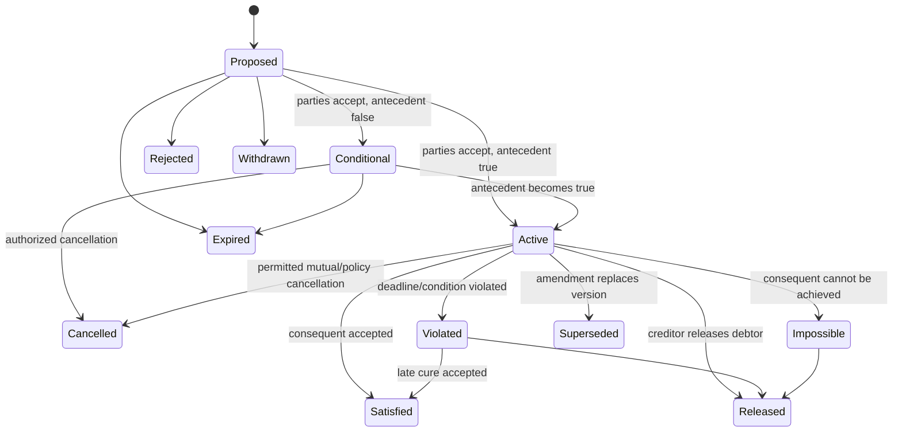
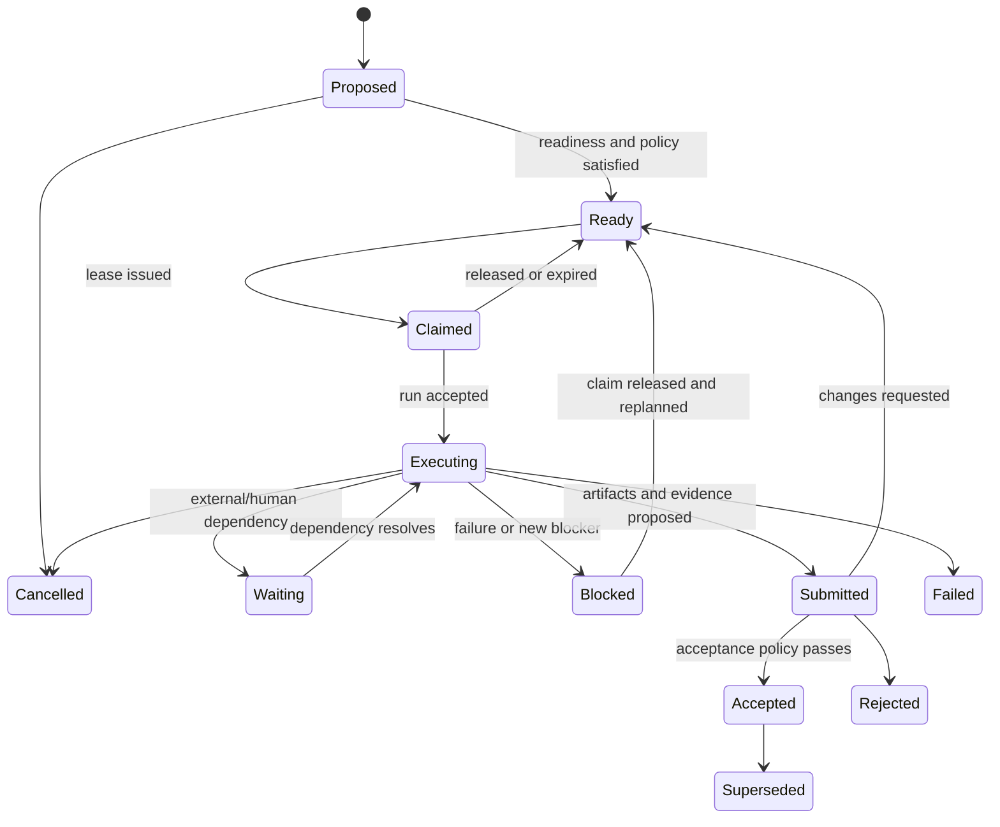

# Trail domain model

**Status:** proposed  
**Date:** 2026-09-28

## Design center

Trail models cooperation as changes to a shared situation under explicit social commitments and scoped authority. A task is a useful plan fragment. A graph is a useful projection. Neither is the atomic truth.

```text
Situation: what participants currently claim or know
Outcome: a desired condition and how acceptance is judged
Commitment: who promises what to whom under which conditions
Execution: bounded action taken under a claim and capabilities
Evidence: support for a claim or acceptance criterion
Acceptance: an authorized judgment about an exact subject version
```

## Semantic layers

| Layer | Stable concepts | Purpose |
|---|---|---|
| social | principal, request, offer, commitment, delegation, release, violation | who owes what to whom |
| intentional | situation, outcome, criterion, assumption, risk, decision | why work exists and what result is desired |
| operational | work item, dependency, claim, lease, run, checkpoint, budget | how authorized action proceeds |
| epistemic | claim, evidence, observation, inference, dispute, confidence | what is believed and why |
| governance | workspace, policy, capability, approval, exception, revocation | who may decide or act |
| provenance | event, activity, artifact, identity binding, derivation | how state and outputs came to exist |
| federation | node, home authority, boundary contract, disclosure, receipt | what independent domains share |

## Aggregate boundaries

### Workspace

Authority for membership, default policy, retention, disclosure, and namespace. A workspace is not assumed to equal a Graycode Cloud project, Git repository, organization, or team.

### Outcome

Owns the desired state, criteria, steward, scope, lifecycle, and direct relation to situation claims. Work decompositions can change without rewriting the outcome.

### Commitment

Owns the accepted social contract, parties, conditions, lifecycle, amendments, delegation, release, discharge, and violation. Requests and offers become inputs to a commitment; they do not silently create one.

### Work item

Owns operational lifecycle, readiness conditions, resource declarations, claims, and run references. It is linked to the outcome/commitment it serves.

### Policy and capability

Owns the authorization rule/version and grants. Policies decide who may propose, execute, verify, accept, disclose, delegate, or administer.

### Evidence packet

Owns claims tested, methods, results, artifacts, evaluators, limitations, and validity. Acceptance points to an immutable packet/version.

## Entities and value objects

| Object | Essential fields |
|---|---|
| `Principal` | ID, kind, home trust domain, status, operator/accountable party |
| `IdentityBinding` | principal, external issuer/subject, proof method, valid interval, revocation |
| `Workspace` | ID, home node, policy set, membership scope, retention, federation/disclosure defaults |
| `SituationClaim` | subject, predicate/type, value/reference, epistemic status, provenance, confidence, valid interval |
| `Outcome` | desired condition, criteria, steward, scope, horizon, version, status |
| `Criterion` | assertion/rubric, evidence rule, evaluator authority, threshold, validity |
| `Request` | requester, target/audience, requested consequent, conditions, expiry, status |
| `Offer` | provider, recipient, offered consequent, conditions, expiry, status |
| `Commitment` | debtor, creditor, antecedent, consequent, timing, policy, version, lifecycle |
| `WorkItem` | purpose link, initial/target state, readiness expression, risk class, lifecycle |
| `Relation` | type, ordered/unordered participants, expression, author, rationale, confidence, validity |
| `Decision` | question, options, criteria, evidence, authority, result, rationale, validity |
| `Risk` | source, affected scope, likelihood model, impact model, signals, mitigations, owner |
| `Resource` | type, authority, capacity, calendar, cost, exclusivity, location |
| `CapabilityGrant` | issuer, subject, action/resource/purpose scope, caveats, delegation depth, expiry, revocation |
| `ClaimLease` | work, holder, authority, fencing token, issued/expiry times, state |
| `Run` | executor, operator, runtime/workload, plan version, lease, grants, budget, environment, status |
| `Checkpoint` | run, sequence, state reference, side-effect ledger, resume constraints |
| `Artifact` | digest, media type, size, storage locator(s), producer, provenance, classification |
| `Evidence` | claim/criterion, method, result, artifact refs, evaluator, uncertainty, validity |
| `Review` | subject version, evidence packet, reviewer, policy, result, findings |
| `Acceptance` | exact subject version, criterion results, evidence, policy version, acceptor, scope |
| `Node` | URI, trust domain, endpoints, protocol versions, keys, status |
| `BoundaryContract` | parties/nodes, disclosed object fields, authority, policy, lifecycle |
| `Event` | envelope, actor, command/cause, subject/version, payload, policy decision, disclosure, signature |

## Commitments

A base social commitment is:

```text
C(debtor, creditor, antecedent, consequent)
```

It means that the debtor is accountable to the creditor for bringing about the consequent when the antecedent holds. Trail adds:

```text
id, scope, policy, valid interval, deadline,
acceptance policy, delegation terms, compensation terms,
version, disclosure, provenance
```

### Commitment lifecycle



Lifecycle semantics must specify who can trigger each transition. A derived status cannot replace an accepted event when authority is required.

## Work and run lifecycle



`Submitted` is intentionally separate from `Accepted`. An executor never closes the loop solely by reporting success.

## Epistemic states

Claims use explicit labels, compatible with Across's provenance discipline:

- observed;
- stated;
- inferred;
- simulated;
- approved/accepted;
- disputed;
- superseded;
- unknown.

These labels describe how a claim is known. They do not imply visibility or authority. For example, an observed test result may still be confidential, and an approved plan may later be wrong.

## Relations and temporal hypergraph

The analytical model is a typed temporal attributed hypergraph:

```text
G = (V, H, typeV, typeH, X, validTime, recordedTime)
```

- `V` contains domain objects such as outcomes, commitments, work, actors, decisions, evidence, artifacts, and resources.
- `H` contains relations that may join many sources and targets.
- types define allowed roles and semantics.
- attributes are versioned.
- valid time says when the fact applies in the modeled world.
- recorded time says when the authority learned/accepted it.

Ordinary storage may represent a hyperedge as a relation object plus participant-role rows. The protocol should not require a graph database.

### Dependency expressions

An expression tree can contain:

```text
All(children)
Any(children)
AtLeast(k, children)
Threshold(metric, comparator, value)
Before/After/Within(time expression)
ResourceAvailable(resource, amount)
PolicySatisfied(policy, action)
EvidenceSatisfied(criterion)
Not(expression)  // coordinated, non-monotonic use only
```

Each evaluation returns:

```text
true | false | unknown
explanation
input versions
evaluated time
staleness/validity
```

Unknown is not false. A policy decides whether unknown blocks work.

## Events, commands, and projections

### Command

A request by a principal to an authority. It may be accepted, denied, conflicted, invalid, or deferred. Network receipt does not mean acceptance.

### Event

An immutable record that an authority accepted a domain fact/transition. Corrections create later events.

### Projection

A rebuildable view of accepted events plus explicitly labeled external/read-model data. Board, graph, inbox, timeline, search, and metrics are projections.

### Proposal

Non-authoritative work awaiting an authority decision. Agent plans, offline commands, remote requests, and inferred relationships are proposals unless accepted.

## Authority classes

| Operation | Authority |
|---|---|
| edit local draft/layout/filter | local replica/user |
| merge collaborative description/comment | CRDT participants under document access policy |
| create a proposal/request/offer | actor's home/workspace policy |
| accept or amend commitment | required parties and commitment policy |
| issue exclusive lease/fencing token | work item's home authority |
| reserve/spend budget | budget authority |
| grant/revoke capability | grant issuer or delegated authority |
| accept evidence/outcome | criterion/acceptance authority |
| disclose an object to remote node | object's disclosure authority |
| mutate external Git/runtime object | external system through scoped connector |

## Dynamic participation

Agent share is an observation:

```text
r(scope, interval) = agent effort / (agent effort + human effort)
```

Effort may be measured by action count, active time, cost, decision ownership, or another declared method. No single measure is universally valid.

Authority is stage-specific:

```text
A(principal, stage, object, context, t) -> allow | deny | defer
```

Stages include observe, analyze, propose, decide, execute, verify, and accept. A workflow may therefore be 90% agent-operated while all high-impact acceptance remains human-authorized, or the reverse.

## Local-to-global coherence

Each workspace or actor may keep a local vocabulary and private state. Shared boundary objects define translation maps into agreed terms. A compatibility check asks whether local views agree on required boundary conditions, not whether all internal state is identical.

Later analysis may use a sheaf-like disagreement energy:

```text
E(x) = sum over boundary e of ||R(u->e)x_u - R(v->e)x_v||^2
```

This remains an analysis feature. It does not enter Protocol v0 until a pilot demonstrates a need and interpretable mapping.

## Deletion, redaction, and correction

- correction: append a superseding or disputing event;
- content redaction: remove/encrypt-delete payload while retaining permitted structural metadata and digest;
- object deletion: create a tombstone and apply retention/disclosure policy;
- identity deletion: remove optional personal profile data while retaining the minimum lawful historical attribution/pseudonym;
- federation withdrawal: send authorized tombstone/revocation; remote legal retention remains explicit;
- projection removal: rebuild without unauthorized content.

“Append-only” must never be used to claim that private payloads cannot be removed. Event integrity and content retention are separate concerns.

