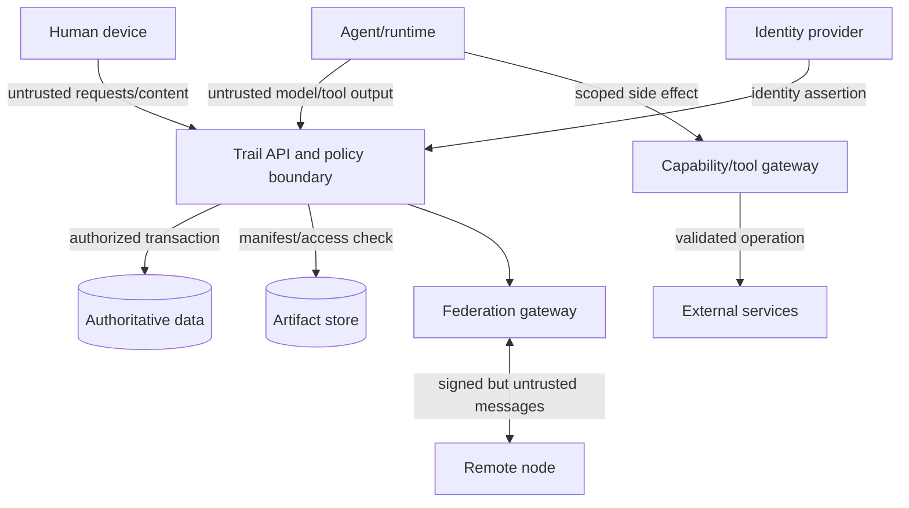

# Security, privacy, and threat model

**Status:** initial design threat model  
**Date:** 2026-09-28  
**Method:** asset/trust-boundary analysis informed by STRIDE, abuse cases, NIST AI RMF, NIST SP 800-207, and OWASP agentic guidance

## Security objectives

1. A principal, agent, service, or remote node can act only within current scoped authority.
2. A compromised or hallucinating agent cannot turn untrusted content into authority.
3. An accepted result is traceable to exact inputs, actors, policy, artifacts, and evidence.
4. Private work and topology do not cross a device, workspace, tool, or federation boundary without disclosure authority.
5. A failure, partition, retry, or stale worker cannot duplicate protected effects or bypass revocation.
6. Operators can stop, isolate, investigate, recover, and rotate trust without falsifying history.
7. Security telemetry supports defense without becoming hidden worker surveillance.

## Assets

- identity bindings, authentication factors, node/workload keys;
- capability grants, memberships, policies, revocations;
- commitments, outcomes, decisions, and accepted events;
- leases/fencing tokens and budget reservations;
- secrets and connector credentials;
- private workspace topology and metadata;
- prompts, context packs, comments, and local drafts;
- artifacts, evidence, reviews, and acceptance records;
- run environments, tools, checkpoints, and side-effect receipts;
- federation inbox/outbox, trust configuration, and peer history;
- backups, encryption keys, migration state, and audit exports;
- human attention and decision authority.

## Adversaries and failure actors

- unauthenticated external attacker;
- malicious or compromised workspace member;
- compromised agent runtime, tool server, connector, or device;
- agent following injected, poisoned, or mistaken instructions;
- malicious or compromised federation node;
- over-privileged administrator or insider;
- colluding executor and verifier;
- supply-chain attacker in dependency, model, skill, plugin, or container;
- accidental operator error;
- strategic participant gaming metrics, priority, evidence, or identity;
- curious platform/provider with access to metadata;
- failing infrastructure producing ambiguous results.

## Trust boundaries

Authentication does not make content, intent, or authorization trustworthy. Every boundary performs its own validation.

## Threats and controls

### Identity spoofing and delegation confusion

Threats:

- agent impersonates a human or another agent;
- one account silently operates several autonomous agents;
- remote node asserts a forged/misbound principal;
- workload steals a peer's credential;
- delegation chain is omitted or truncated.

Controls:

- distinct human, agent, operator, device, service, and workload identities;
- strong human authentication and short-lived sessions;
- workload identity/attestation for managed runners;
- explicit signed/accepted delegation references on runs;
- audience-bound short-lived credentials;
- external identity-binding proof and version history;
- historical attribution preserved across key rotation;
- no identity merge from email/name/model string alone.

### Excessive agency and privilege escalation

Threats:

- broad token lets an agent act across workspaces/resources;
- agent self-approves a larger scope;
- delegated capability exceeds parent authority;
- stale capability remains useful after revocation;
- connector becomes a confused deputy.

Controls:

- deny by default and evaluate every command/tool action;
- grant scope includes resource, action, purpose, constraints, audience, expiry, delegation depth, and budget;
- grants are minted per run or short interval;
- privileged changes require separate authority and cannot be bundled with the requested work;
- revocation and expiry checked at enforcement gateways;
- fencing tokens protect stale workers;
- connectors use named service principals and source-side least privilege;
- policy changes are simulated and audited.

### Goal hijacking, prompt injection, and context poisoning

Threats:

- retrieved issue/comment/web page instructs an agent to ignore policy;
- tool metadata contains malicious instructions;
- memory/checkpoint poisons future runs;
- remote evidence manipulates verifier behavior;
- an agent reframes the outcome to make its result pass.

Controls:

- separate authoritative instructions, policy, untrusted content, and model output structurally;
- tools are selected/authorized by code and policy, not model text alone;
- output is a proposal until domain validation;
- pin exact outcome/criterion/plan versions into a run;
- provenance and epistemic labels on context/memory;
- content sanitization, sandboxed rendering, and artifact scanning;
- independent deterministic checks before model judgment;
- limit recursive retrieval and delegation;
- high-risk changes require human or independent verifier authority.

### Tool misuse and unexpected code execution

Threats:

- arbitrary command execution outside sandbox;
- path traversal or workspace escape;
- environment variables/secrets leak into logs or artifacts;
- tool called with valid schema but unsafe semantic arguments;
- two agents share a database, port, or mutable dependency cache.

Controls:

- isolated worktree/filesystem/process/network environment from Rover or equivalent;
- declared read/write/resource scope;
- capability gateway checks semantic resource and purpose;
- separate credentials per run and tool;
- secret injection only at the tool boundary with response redaction;
- egress control and destination allowlists for sensitive runs;
- immutable base images and dependency pinning;
- quotas for CPU, memory, disk, processes, network, time, and output;
- unique runtime resources or explicit coordination for shared state.

### Evidence forgery and false completion

Threats:

- agent fabricates test results or artifact references;
- mutable URL changes after review;
- executor and verifier collude;
- evidence is copied from another subject/version;
- acceptance is applied to stale work.

Controls:

- content digests and signed provenance/attestations;
- evidence binds criterion, subject version, method, environment, evaluator, and time;
- source systems queried/reconciled where required;
- independence policy checks operator/runtime relationships;
- acceptance uses optimistic version check and exact evidence packet;
- conflicting evidence remains visible;
- evidence freshness and environment validity;
- periodic/sampled post-acceptance verification for selected risk classes.

### Replay, duplication, race, and split brain

Threats:

- repeated signed event creates repeated action;
- cancellation/revocation crosses with execution;
- two workers hold apparent leases;
- two federation nodes claim home authority;
- timeout causes duplicate irreversible action.

Controls:

- persistent idempotency results and inbox deduplication;
- authority-side versions and causal references;
- leases plus fencing at the actual side-effect gateway;
- transactional event/outbox write;
- reconciliation before retry after ambiguous result;
- signed authority-transfer chain;
- quarantine on split brain or missing causal dependencies;
- no last-write-wins for commitments, grants, budgets, or acceptance.

### Data disclosure and inference

Threats:

- private child graph leaks through shared readiness or counts;
- search index returns unauthorized snippets;
- error/denial reveals object existence or membership;
- model provider receives unnecessary confidential context;
- local cache retains data after access revocation;
- logs/traces contain prompts, secrets, or personal data.

Controls:

- field/object/audience/purpose disclosure policy;
- authorization at query result and artifact access;
- privacy-tested coarse shared claims;
- safe public denial reasons with restricted audit detail;
- context minimization and provider data-policy selection;
- encrypted local cache with revocation/retention workflow;
- structured telemetry allowlist and automated secret/PII detection;
- separate indexes by trust scope where needed;
- redaction and encrypted-payload deletion design.

### Federation abuse

Threats:

- message flooding and expensive signature/schema work;
- malicious but correctly signed content;
- key rollback or discovery poisoning;
- remote node launders unauthorized claims through another node;
- peer selectively withholds or reorders facts;
- moderation action used to erase valid obligations.

Controls:

- validate envelope size/type before expensive processing;
- per-peer/workspace rate, storage, and compute quotas;
- replay windows and key validity history;
- local policy and object-home authority checks after signature validation;
- quarantine/sandbox remote content;
- causal gap detection and receipts;
- peer block/suspend distinct from contract release/dispute;
- exportable shared history and clear trust indicators;
- do not derive global reputation from federation popularity.

### Supply chain and plugin risk

Threats:

- compromised dependency, skill, MCP server, plugin, container, or update;
- typosquatted adapter;
- build artifact differs from reviewed source;
- plugin silently gains capabilities after update.

Controls:

- signed releases, SBOM, provenance, dependency scanning, and reproducible verification where feasible;
- pinned versions/digests and allowlisted publishers;
- plugin manifest declares capabilities/data flows;
- reapproval when authority materially expands;
- sandbox and network restrictions;
- vulnerability response and revocation channel;
- no automatic execution of imported skill text as authority.

### Availability and resource exhaustion

Threats:

- recursive agents consume cost and human review;
- peer or connector backlog exhausts storage;
- graph query or policy evaluation becomes adversarially expensive;
- artifact upload bomb;
- notification flood hides critical events.

Controls:

- depth/fan-out/step/time/token/cost budgets;
- admission control includes human review capacity;
- bounded query depth/complexity and precomputed projections;
- upload size/type/quota and streaming validation;
- backpressure, dead-letter/quarantine, and priority queues;
- notification deduplication/batching/escalation;
- circuit breakers that do not bypass domain truth.

### Insider misuse and surveillance

Threats:

- administrator reads private content without need;
- telemetry becomes hidden productivity scoring;
- inferred traits affect assignment;
- audit export exposes more than required;
- policy exception favors powerful actors without visibility.

Controls:

- least-privilege administrative roles and just-in-time access;
- separate content access from system administration;
- audited access to sensitive content and exports;
- purpose limitation, retention, notice, contestability, and worker access to relevant records;
- no universal person/agent reputation score;
- fairness tests and scoped task-class evaluation;
- exceptions include issuer, reason, scope, expiry, and review;
- privacy review of every new metric.

## Agentic security control matrix

| Risk area | Primary Trail controls |
|---|---|
| goal/instruction hijack | immutable plan version, content/instruction separation, proposals, policy gateway |
| tool misuse | least-agency capabilities, semantic authorization, sandbox, egress and quotas |
| identity/privilege abuse | distinct identities, delegation chain, short-lived grants, revocation/fencing |
| supply-chain compromise | provenance, signed/pinned components, manifest capability review, sandbox |
| unexpected code execution | isolated runtime, tool allowlist, filesystem/network/process limits |
| memory/context poisoning | epistemic labels, provenance, validation, scope/expiry, disputed claims |
| insecure inter-agent communication | authenticated messages, schema validation, untrusted payload treatment |
| cascading failures | fan-out/depth limits, circuit breakers, independent acceptance, quarantine |
| human-agent trust exploitation | calibrated evidence, meaningful approvals, explanations, takeover/appeal |
| drift/rogue behavior | runtime monitoring against grants, checkpoints, kill control, reauthorization on profile change |

This matrix is maintained against the current [OWASP Agentic Security Initiative](https://genai.owasp.org/initiatives/agentic-security-initiative/); exact category IDs and language must be pinned during implementation.

## Cryptographic and key-management requirements

- algorithms and key sizes use current vetted libraries and policy; no custom cryptography;
- separate node signing, workload identity, user authentication, data-encryption, and artifact-signing keys;
- keys have issuer, purpose, validity, rotation, revocation, and compromise history;
- private keys remain in platform key stores/HSM/KMS where the deployment profile supports it;
- signed data uses deterministic/canonical serialization or signs a stable digest envelope;
- key discovery is authenticated and rollback-resistant;
- backup design states which keys are recoverable and which encryption loss is intentional;
- compromised key response can suspend acceptance without deleting historical verification data.

## Secrets

Secrets must never be:

- embedded in agent prompts or commitment/event payloads;
- returned in tool output when a boolean/receipt will suffice;
- written to checkpoint, artifact, telemetry, or exception text;
- shared across tenants or unrelated runs;
- persisted on offline devices without an explicit device-secret policy.

Use brokered, audience-bound, short-lived credentials. Scan outgoing evidence/logs and rotate on suspected exposure.

## Human authorization design

An approval UI is part of the security boundary. It must show:

- actor/agent/operator and requesting source;
- exact action and affected resources;
- capability, purpose, duration, and budget;
- external side effects and reversibility;
- evidence/uncertainty and why approval is required;
- safe alternative, expiry, and ability to narrow scope.

Approvals should not be requested repeatedly when users cannot reasonably inspect the action. Redesign or independently verify instead of creating approval fatigue.

## Audit versus telemetry

### Domain audit

Retains accepted security and business facts: grant, revoke, claim, dispatch, spend, evidence, review, accept, disclose, administer. It is access controlled and retention governed.

### Diagnostic telemetry

Metrics/traces/logs support reliability and detection. They avoid payload content, expire sooner, and are not proof of a domain transition.

### Security signals

- denied or escalated capability requests;
- stale fencing token use;
- unusual delegation depth/fan-out;
- repeated ambiguous side effects;
- evidence digest/availability failure;
- connector/federation replay or schema abuse;
- secret/PII detection in output;
- break-glass and sensitive audit access;
- policy changes that expand authority.

## Incident response

Minimum runbooks:

1. compromised human/agent/device identity;
2. compromised node or signing key;
3. prompt injection with tool action;
4. secret exposure;
5. malicious connector/plugin/update;
6. duplicate or unknown external side effect;
7. evidence/artifact tampering;
8. cross-workspace disclosure;
9. federation abuse or peer compromise;
10. event-store corruption or ransomware.

Each runbook defines detection, containment, authority to act, evidence preservation, key/capability rotation, notification, recovery, and post-incident requirements.

## Security gates

Before bounded agent execution:

- capability gateway and fencing are enforced outside model control;
- secrets flow is threat-modeled and tested;
- sandbox escape and egress tests pass;
- ambiguous side-effect recovery is exercised;
- independent verification policy is implemented;
- kill/quarantine/rotation drill succeeds.

Before federation:

- independent protocol/security review;
- signed-envelope canonicalization tests;
- replay, key rotation/rollback, flood, schema bomb, and malicious-content tests;
- privacy inference tests;
- peer block and compromised-node recovery drill;
- conformance implementation independent of the main code path.

## Residual risks

- a malicious authorized human can approve harmful work;
- evidence can be incomplete even when authentic;
- exported or federated information may not be deletable from an uncooperative party;
- models and detectors can miss manipulation or secrets;
- sandbox and supply-chain controls reduce but do not eliminate compromise;
- complex policy can be correct in code and wrong in organizational intent;
- identity proves control of a credential, not honesty or competence.

These risks require bounded authority, independent review, transparency, recovery, and honest product language.

