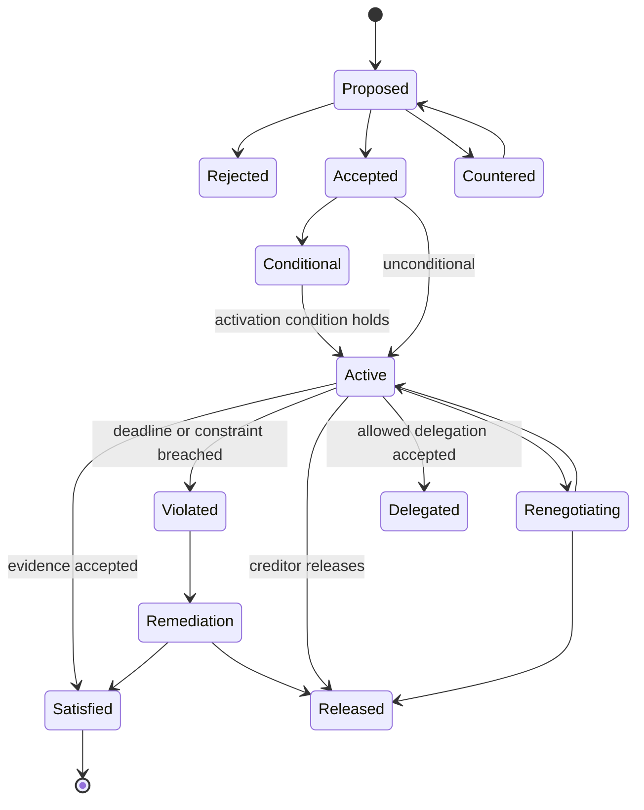
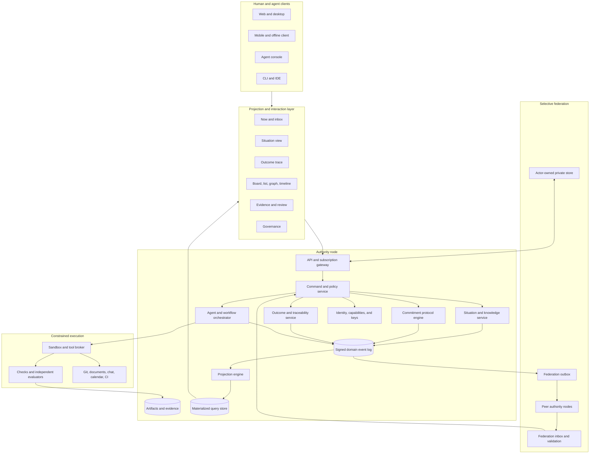
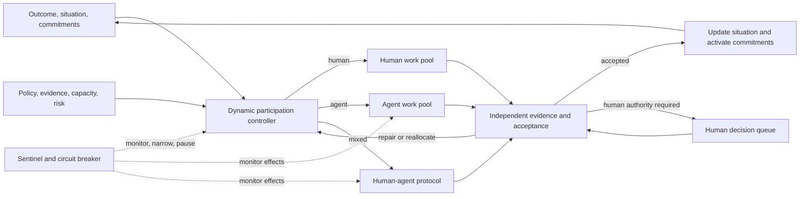
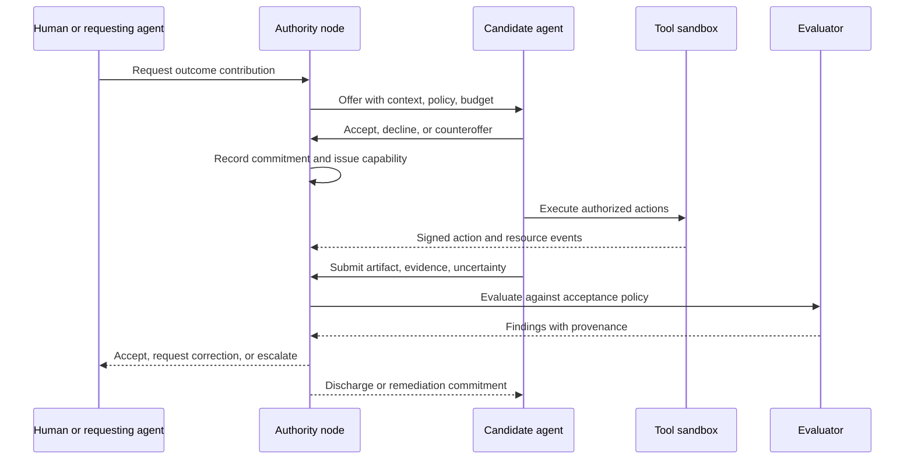

# Beyond GraphDone: an evidence-led design for decentralized human-agent coordination

**Prepared:** 2026-09-28  
**Status:** research synthesis and architecture decision record  
**Companion documents:** [landscape review](./decentralized-agentic-work-management-landscape-2026.md) and [initial mathematical architecture](./first-principles-work-coordination-architecture.md)

## Executive conclusion

Do not build a decentralized clone of Jira, Linear, Asana, Monday, ClickUp, or GraphDone.

Those products begin with a work item and add relations, views, automation, or voting. That model is useful for planned delivery, but it omits much of what makes cooperation succeed or fail:

- people and agents must establish a shared understanding of a changing situation;
- autonomous actors make, renegotiate, delegate, discharge, and sometimes violate commitments;
- goals, assumptions, decisions, evidence, and authority must remain traceable;
- knowledge work often cannot be specified as a complete workflow in advance;
- participants hold different information, language, incentives, and access rights;
- organizations need local sovereignty while sharing carefully selected facts;
- automation can reduce agency, conceal uncertainty, and create more coordination work;
- failures are often failures of communication, authorization, attention, or adaptation rather than missing graph edges.

The proposed product is a **federated commitment and situation fabric**.

The operating model uses a **fully dynamic human-agent ratio**. A scope may run at 90/10, 80/20, 50/50, or human-led operation, and the ratio can change as evidence, risk, reversibility, workload, or policy changes. The platform measures consequential actions, impact, and attention demand rather than headcount. Humans do not approve every step, and agents do not receive permanent autonomy merely because they performed well elsewhere.

Its canonical data is:

1. observations and claims about the current situation;
2. desired outcomes and acceptance conditions;
3. commitments between identifiable, authorized actors;
4. decisions, assumptions, risks, and policies;
5. actions, artifacts, and evidence;
6. signed events describing how these records changed.

Tasks, boards, dependency graphs, schedules, inboxes, and agent queues are derived views. They are important interfaces, but they are not the ontology of work.

This is a materially different product thesis from GraphDone. GraphDone organizes work as a graph and computes priority through graph structure and democratic input. The proposed system organizes cooperation through shared situation, explicit commitments, evidence, and scoped authority. It can render a graph when a graph helps.

---

## 1. Research method and limits

No finite review can read “all” open-source projects, papers, websites, articles, and social posts. This review instead uses a reproducible breadth-first method:

- inspect representative and popular open-source systems across project management, agent orchestration, local-first software, forges, federation, and knowledge management;
- prefer official repositories, specifications, original papers, systematic reviews, and standards;
- use product claims as hypotheses rather than proof;
- search adjacent fields that expose assumptions hidden by project-management software;
- identify repeated mechanisms and known failure modes;
- convert findings into falsifiable design decisions and experiments.

The research spans:

- computer-supported cooperative work;
- coordination theory and organizational design;
- distributed cognition and shared mental models;
- requirements and traceability;
- workflow, adaptive case management, and process mining;
- operations research, queues, scheduling, and temporal networks;
- multi-agent planning, commitments, and mechanism design;
- human factors and human-AI interaction;
- cybernetics, resilience engineering, and safety;
- institutional and polycentric governance;
- local-first and distributed systems;
- identity, authorization, privacy, and provenance;
- current open-source work and agent platforms.

The earlier landscape report contains the detailed OSS comparison. This document records what the broader evidence changes in the architecture.

---

## 2. Assumptions the research rejects

### 2.1 “A task is the atomic unit of work”

A task can represent an instruction, intention, reminder, reservation, negotiation, experiment, or administrative container. Those have different semantics.

The more stable unit is an accountable commitment:

> actor A commits to actor or group B that condition Y will hold when condition X holds, within stated authority and constraints.

A commitment may generate zero, one, or many private tasks. The debtor controls its internal plan unless the agreement says otherwise.

### 2.2 “The graph is the product”

Graphs are valuable representations for dependency, provenance, causality, communication, and authority. A single visual graph becomes cognitively expensive, leaks information across boundaries, and mixes relations with different semantics.

Use typed temporal graphs internally. Expose purpose-specific projections:

- a commitment inbox;
- a shared situation page;
- an outcome trace;
- a readiness list;
- a review queue;
- a resource schedule;
- a risk and assumption map;
- a filtered dependency graph.

### 2.3 “Priority is a universal scalar”

Priority depends on stakeholder, time, authority, risk tolerance, obligations, scarce resources, and uncertainty. Collapsing those into one number hides tradeoffs and invites gaming.

The default recommendation should present:

- hard obligations and deadlines;
- actions that unblock accepted commitments;
- Pareto-efficient alternatives;
- expected value and uncertainty;
- information-gathering options;
- the policy and preferences that produced the ordering.

### 2.4 “Voting makes coordination democratic”

Voting is one mechanism for a bounded decision. It does not establish legitimate membership, protect minorities, resolve disputes, stop Sybils, allocate authority, or ensure accountability. Empirical DAO research repeatedly finds concentrated influence even where token voting exists.

Governance requires boundaries, participation in rule changes, monitoring, appeals, graduated remedies, local autonomy, and nested institutions.

### 2.5 “Automation removes coordination work”

Automation often moves work into exception handling, interpretation, supervision, access management, and repair. Higher autonomy can weaken situation awareness and create brittle handoffs.

Every automation must therefore specify:

- what it may observe;
- what it may infer;
- what it may decide;
- what effects it may cause;
- when it must ask, explain, checkpoint, or stop;
- how a person can correct, appeal, undo, or take over.

### 2.6 “Self-hosted means decentralized”

Self-hosting changes deployment ownership. Decentralization also needs portable identity, selective sharing, protocol interoperability, authority resolution, migration, revocation, and behavior under partitions.

### 2.7 “A predefined workflow is enough”

Routine work benefits from explicit procedures. Novel knowledge work changes as evidence arrives. A platform must combine:

- procedural workflows for stable sequences;
- declarative constraints for required conditions;
- adaptive cases for evolving situations;
- commitments for cross-boundary accountability;
- exceptions and discretionary actions with explanations.

---

## 3. What each research field contributes

### 3.1 Coordination theory: manage dependencies, not task cosmetics

Malone and Crowston define coordination as managing dependencies among activities. Their taxonomy includes shared resources, producer-consumer relations, simultaneity, and task-subtask relations.

Design consequences:

- dependency edges need domain semantics;
- every dependency type needs an associated coordination mechanism;
- “blocked by” alone is inadequate;
- changing a dependency should expose the resource, information, timing, or responsibility conflict it represents.

Example dependency types:

| Dependency | Coordination mechanism |
|---|---|
| prerequisite state | evidence-backed condition |
| shared scarce resource | reservation or allocation policy |
| simultaneous action | rendezvous window |
| producer-consumer | delivery commitment and acceptance |
| incompatible effects | mutual exclusion or policy denial |
| information need | question, observation, or experiment |
| shared decision | decision protocol and quorum |
| task-subtask | contribution contract and aggregation rule |

### 3.2 CSCW: represent articulation work

Schmidt and Bannon call attention to articulation work: the work required to align distributed cooperative activities. It includes clarifying, sequencing, negotiating, repairing, translating, and maintaining awareness.

Most trackers bury articulation work in comments and meetings. The platform should make it visible without turning conversation into bureaucracy.

First-class records should include:

- request;
- offer;
- commitment;
- clarification;
- assumption;
- decision;
- exception;
- handoff;
- escalation;
- dispute;
- acceptance or rejection with reason.

### 3.3 Boundary objects: preserve shared identity and local meaning

Star and Griesemer show how heterogeneous groups cooperate through boundary objects that remain recognizable across communities while allowing local interpretations.

A cross-organization outcome should therefore have:

- a small shared contract;
- locally extensible views and terminology;
- stable identifiers and versioned schemas;
- explicit translations between local and shared fields;
- declared loss when a translation is incomplete.

Federation should share the boundary object, not each participant's entire internal task graph.

### 3.4 Distributed cognition: the workspace is part of the team mind

Hutchins' work shows that cognition can be distributed across people, representations, tools, and the environment. Shared displays do more than report status: they participate in remembering and coordinating.

The product must preserve:

- what the team currently believes;
- which claims are uncertain or disputed;
- who or what produced each claim;
- what changed since an actor last participated;
- why the present plan exists;
- how to resume after an interruption.

This leads to a **situation model** rather than a status dashboard.

### 3.5 Common ground and transactive memory

Collaboration requires enough shared context to interpret actions, plus knowledge of who knows what. Shared mental-model research links aligned team knowledge with better team process and performance, while transactive-memory research emphasizes locating expertise across the group.

The product needs an expertise and context layer:

- claims may cite responsible knowledge sources;
- actors may declare capabilities and confidence;
- the system can recommend who should review or clarify;
- sensitive expertise profiles remain locally controlled;
- the system should show comprehension gaps before assuming agreement.

### 3.6 Requirements engineering: preserve the path from intent to evidence

Goal-oriented requirements methods connect goals, alternatives, obstacles, responsibilities, and operational requirements. Traceability research finds persistent gaps across the full lifecycle.

The core trace should be:

```text
need -> outcome -> measure -> decision -> commitment -> action
     -> artifact -> observation -> evidence -> acceptance
```

Assumptions, risks, and policy versions attach to the relevant links. A completed action cannot silently imply that an outcome was achieved.

### 3.7 Adaptive case management: evolving information before fixed sequence

OMG's CMMN treats a case as living information with actions that may occur in an unpredictable order as the situation evolves. This complements BPMN's predefined sequences and DMN's explicit decisions.

Adopt the principle without cloning the notation:

- every initiative has a case file containing relevant situation records;
- entry and exit criteria activate or complete possible actions;
- discretionary actions remain possible under policy;
- a reusable protocol can suggest actions without forcing a fixed path;
- milestones express achieved states rather than columns traversed.

### 3.8 Process mining: learn processes from event evidence

The IEEE Process Mining Manifesto distinguishes discovery, conformance checking, and process enhancement from event logs.

The platform should not force teams to fully model work before using it. It should capture clean events, then offer:

- discovered coordination patterns;
- handoff and waiting-time analysis;
- conformance to policies that teams actually adopted;
- recommendations for reusable protocols;
- drift detection when a protocol no longer matches practice.

Use this for learning and system improvement, never covert worker scoring.

### 3.9 Multi-agent commitments and SharedPlans

Contract Net distributes task allocation through announcements, bids, awards, and results. Commitment-based protocols describe the social state between autonomous actors without prescribing their internal implementations. SharedPlans formalizes partial knowledge, intentions, mutual support, and contracting actions to others.

These imply:

- actors remain autonomous;
- a shared plan can be incomplete;
- requests and commitments must be distinguished;
- assignment needs acceptance;
- delegation changes accountability only under explicit rules;
- actors should communicate changes that threaten a joint activity;
- correctness can be evaluated over protocol states even when internal plans differ.

### 3.10 Human factors: protect attention and recovery

Interruption research finds that fragmented work harms resumption and prospective memory. Automation research separates information acquisition, analysis, decision selection, and action implementation because risks differ at each level.

Design consequences:

- batch low-urgency notifications;
- show interruption cost when requesting urgent work;
- preserve a compact resumption capsule: goal, last observation, current hypothesis, next intended action, open commitments, and relevant artifacts;
- let actors define focus windows and delegation policies;
- show uncertainty before suggestions;
- require stronger control for action than for analysis;
- support correction and recovery after automation errors.

### 3.11 Psychological safety and worker agency

Teams learn when people can raise problems, admit uncertainty, and challenge assumptions. Algorithmic-management research connects direct automated control with reduced autonomy and increased stress.

Product requirements:

- dissent and uncertainty are normal states, not failures;
- private drafts remain private until shared;
- people can see and contest inferences about them;
- no hidden productivity score;
- policy explains why an assignment or escalation occurred;
- refusal, counteroffer, appeal, and safe escalation are first-class operations;
- agents cannot silently evaluate people for employment decisions.

### 3.12 Resilience and safety

STAMP treats safety as enforcement of constraints across a sociotechnical control system. Resilience engineering emphasizes adaptation, graceful degradation, and the ability to respond when models are incomplete. High-reliability organizing emphasizes attention to weak signals, operational sensitivity, resilience, and deference to relevant expertise.

The platform should support:

- safety constraints independent of workflow success;
- near-miss and anomaly observations;
- temporary authority transfer during incidents;
- explicit degradation modes;
- escalation based on expertise and proximity to operations;
- post-event learning that preserves competing interpretations;
- simulation of policy and dependency changes before rollout.

### 3.13 Polycentric governance

Ostrom's work supports locally tailored, nested governance rather than one global rule system. DAO studies warn that visible voting can coexist with concentrated control.

Each federation scope needs:

- membership boundaries;
- constitutional rules for changing operational rules;
- actor rights and responsibilities;
- transparent monitoring within legitimate access;
- low-cost dispute resolution;
- graduated remedies;
- an exit and data-portability path;
- higher-level coordination only where lower-level scopes cannot solve the problem.

### 3.14 Local-first and distributed systems

Local-first software shows the value of offline operation and user-controlled copies. CRDTs merge suitable concurrent edits. CALM shows why monotonic facts can be processed without global coordination; non-monotonic decisions need coordination.

Classify operations:

| Operation | Default distributed treatment |
|---|---|
| add an observation | append and merge |
| attach evidence | append and merge |
| create a private draft | local only |
| add a nonexclusive tag | CRDT merge |
| accept a commitment | authoritative compare-and-set |
| allocate exclusive budget | authority lease or transaction |
| revoke a capability | coordinated, promptly propagated |
| declare an outcome accepted | authorized state transition |
| edit historical evidence | supersede; retain prior record |

### 3.15 Federation and user-controlled data

Existing protocol families solve different problems:

| Family | Useful idea | Limitation for this product |
|---|---|---|
| ActivityPub / ForgeFed | server federation and interoperable activities | work semantics and private cross-org policy remain underspecified |
| Matrix | signed event graphs, room-scoped replication, state resolution | optimized for shared room history and communication |
| AT Protocol | account-owned repositories and portable hosted identity | primarily public data and social distribution assumptions |
| Solid | data separated from applications with resource-level access control | ecosystem maturity and cross-pod query complexity |
| Nostr | simple signed events and replaceable relays | weak shared state, deletion, private policy, and institutional authority |
| Git/Radicle | content integrity, replication, offline work | merge semantics fit files and references more than all coordination state |

Recommended approach:

- organization-owned nodes for authoritative shared work;
- actor-owned private workspace for drafts, preferences, and memory;
- cryptographically signed event envelopes;
- scoped replication based on participation and capability;
- portable export and protocol adapters;
- no blockchain in the core path;
- no assumption that all work is public or globally replicated.

### 3.16 Counter-evidence and design guardrails

The synthesis should not turn commitments, event logs, or case models into a new ideology.

Lucy Suchman's critique of language-action systems argues that situated conversation is richer and less predictable than a predefined speech-act model. Research on social commitments also finds that interaction protocols alone cannot control malicious or rule-breaking actors in an open system; institutions and enforcement are still required. Event logs create privacy and retention risks, especially when reused for process mining. Adaptive case notation can itself become specialist modeling work.

Guardrails:

- ordinary conversation stays ordinary conversation;
- the system suggests a structured request or commitment only when accountability benefits from it;
- users can speak, repair misunderstanding, and act outside a modeled protocol when policy permits;
- “commitment” means an explicit accepted relation, not an inference from chat sentiment;
- the state machine records minimum coordination facts rather than every conversational move;
- institutional policy handles membership, enforcement, remedies, and appeals;
- event payloads minimize personal data and use purpose-bound retention;
- sensitive content can be stored separately under erasable encryption keys while the log retains a non-identifying integrity record;
- process mining operates on scoped, privacy-reviewed projections rather than the raw universal log;
- teams can use a light interaction mode without drawing CMMN, BPMN, or formal protocol diagrams.

This is why the proposal combines commitments with situation records, policy, free conversation, evidence, and adaptive action.

### 3.17 Incomplete contracts, incentives, and decision provenance

Contract theory adds another reason to avoid a fully specified task graph: parties cannot foresee, observe, or encode every relevant future condition. Ownership and governance determine who may decide when the agreement is incomplete. Multi-task principal-agent research also shows that strong incentives on easily measured work can draw effort away from valuable work that is hard to measure.

Design consequences:

- a commitment specifies the boundary outcome, authority, constraints, and acceptance rather than micromanaging every internal action;
- residual decision rights must be explicit when the situation is not covered;
- measures inform decisions but do not become individual productivity targets by default;
- metrics use multiple signals, qualitative evidence, periodic review, and anti-gaming checks;
- the platform records decision provenance: relevant inputs, policy, model or rule version, authorized decider, output, downstream effect, and later correction;
- outcome measures can be revised through an authorized decision without rewriting the history of what participants originally agreed.

This supports accountable adaptation when a complete contract or plan is impossible.

---

## 4. Design-space comparison

Score: 1 = weak fit, 5 = strong fit. Scores are hypotheses to test, not scientific measurements.

| Product model | Adaptation | Cross-org autonomy | Accountability | Cognitive fit | Human-agent fit | Main failure |
|---|---:|---:|---:|---:|---:|---|
| issue tracker | 3 | 2 | 3 | 4 | 3 | state labels replace real semantics |
| project/task graph | 3 | 2 | 3 | 2 | 4 | graph becomes ontology and UI burden |
| fixed workflow engine | 2 | 3 | 5 | 2 | 4 | cannot handle novelty and exceptions |
| work marketplace | 3 | 4 | 3 | 3 | 4 | price/bids omit trust and shared purpose |
| shared blackboard | 5 | 3 | 2 | 4 | 5 | unclear responsibility and closure |
| adaptive case system | 5 | 3 | 4 | 4 | 4 | federation and autonomous actors are secondary |
| commitment protocol | 5 | 5 | 5 | 3 | 5 | can become legalistic without good UX |
| institutional commons | 4 | 5 | 5 | 2 | 4 | governance burden can dominate ordinary work |
| proposed synthesis | 5 | 5 | 5 | 4 | 5 | must keep complexity behind progressive disclosure |

The synthesis uses:

- the shared blackboard for situation awareness;
- adaptive cases for evolving work;
- commitments for accountability across autonomous boundaries;
- outcome traceability for purpose and validation;
- scoped institutions for governance;
- event logs for learning and audit;
- task and graph projections for execution.

---

## 5. Core domain model

### 5.1 Stable primitives

| Primitive | Meaning |
|---|---|
| `Scope` | authority, membership, visibility, policy, and replication boundary |
| `Actor` | human, agent, service, team, organization, or role |
| `Outcome` | desired state with measures and acceptance authority |
| `Situation` | evolving set of relevant observations, claims, hypotheses, and uncertainties |
| `Commitment` | accountable social relation between debtor and creditor |
| `Decision` | authorized selection among alternatives with rationale |
| `Policy` | versioned rules governing permissions, transitions, evidence, and escalation |
| `Action` | an attempted state-changing operation |
| `Artifact` | addressable output, input, or boundary object |
| `Evidence` | observation used to evaluate a claim or acceptance condition |
| `Capability` | attenuable authority to observe or cause a class of effects |
| `Protocol` | reusable declarative interaction pattern |
| `Event` | signed, immutable statement that a domain fact was asserted or changed |

### 5.2 Useful derived objects

These are projections, cached aggregates, or UI containers:

- task;
- issue;
- project;
- milestone;
- sprint;
- board column;
- priority;
- progress percentage;
- agent run;
- dependency graph;
- timeline;
- dashboard.

Treating them as derived prevents one product metaphor from controlling the protocol.

### 5.3 The commitment object

Let a commitment be:

\[
C = (id, s, d, c, \alpha, \beta, [t_0,t_1], q, p, e, v)
\]

where:

- \(s\) is scope;
- \(d\) is debtor, who becomes responsible;
- \(c\) is creditor, to whom responsibility is owed;
- \(\alpha\) is the activation condition;
- \(\beta\) is the promised condition;
- \([t_0,t_1]\) is the relevant time window;
- \(q\) contains constraints and quality conditions;
- \(p\) is the governing policy version;
- \(e\) is the evidence and acceptance rule;
- \(v\) is version and provenance.

Suggested lifecycle:



A task assignment without the assignee's acceptance is a request, not a commitment.

### 5.4 The situation model

A situation is a time-varying, scoped epistemic record:

\[
S_t = \{(claim, source, observedAt, validFor, confidence, visibility, status)\}
\]

Claim status is one of:

- observed;
- inferred;
- hypothesized;
- disputed;
- superseded;
- invalidated.

Confidence should express evidential uncertainty, not social rank. A source may be a person, agent, sensor, document, test, or external system.

### 5.5 Outcomes and acceptance

An outcome is satisfied only when an authorized acceptance rule evaluates adequate evidence:

\[
Accept(O) = Policy_p(E_O, M_O, A_O, t)
\]

where \(E_O\) is evidence, \(M_O\) is measures, \(A_O\) is accepting authority, and \(p\) is the recorded policy version.

This prevents “all tasks closed” from being mistaken for value delivered.

---

## 6. Product experience

### 6.1 Six primary spaces

### Now

Shows commitments requiring attention, reviews, decisions, questions, and resumable work. It explains why each item is present.

### Situation

Shows current observations, disputed claims, changes, assumptions, incidents, and missing information. This is the team's shared working memory.

### Outcomes

Shows desired states, measures, alternatives, traceability, evidence, and acceptance.

### Coordination

Shows cross-actor commitments, handoffs, dependencies, protocols, capacity conflicts, and escalation paths.

### Evidence

Shows artifacts, runs, tests, observations, provenance, reviews, and decisions.

### Governance

Shows membership, authority, active policy, capability grants, disputes, appeals, and policy-change proposals.

### 6.2 Progressive disclosure

The default interaction should feel lighter than a project-management suite:

1. describe the desired change;
2. attach or observe relevant context;
3. ask or offer help;
4. agree on responsibility and acceptance;
5. act;
6. attach evidence;
7. accept, correct, or renegotiate.

Formal protocol state, federation envelopes, and graph topology appear when needed.

### 6.3 Resumption capsule

For every active commitment or action, generate a private, editable capsule:

```yaml
purpose: what I am trying to change
current_state: last reliable observation
working_theory: present hypothesis and uncertainty
last_action: what I just did
next_action: intended next step
open_loops: questions, dependencies, promises
artifacts: relevant links and versions
changes_since_pause: compact causal summary
```

Agents and humans can both use this. Private notes must not become shared training or evaluation data without explicit policy.

---

## 7. Logical architecture



### Architectural rule

The event log is a record of accepted domain statements, not a universal public ledger. Each authority node owns its log and exposes scoped, signed projections to peers.

---

## 8. Federation model

### 8.1 Three ownership zones

### Private actor zone

Contains drafts, personal memory, focus preferences, private notes, and credentials. The actor chooses storage and sharing.

### Organizational authority zone

Contains authoritative outcomes, policies, accepted commitments, decisions, and evidence governed by that organization.

### Shared boundary zone

Contains the minimum replicated contract necessary for collaboration: identifiers, parties, conditions, deadlines, public or shared evidence, and protocol state.

### 8.2 Federation envelope

```json
{
  "eventId": "urn:uuid:...",
  "type": "CommitmentAccepted",
  "actor": "did:web:example.org:actors:alice",
  "authority": "https://work.example.org",
  "scope": "urn:work:scope:partner-release",
  "object": "urn:work:commitment:...",
  "previous": ["sha256:..."],
  "occurredAt": "2026-09-28T10:00:00Z",
  "policy": "sha256:...",
  "capability": "urn:ucan:...",
  "payload": {},
  "attachments": ["ipfs-or-https-content-address"],
  "signature": "..."
}
```

The wire representation can change. The required semantics are stable identity, authority, causal predecessors, policy version, scoped capability, payload, and verifiable authorship.

### 8.3 Conflict rules

- observations from different actors can coexist;
- claims may be disputed rather than overwritten;
- append-only evidence merges;
- concurrent text drafts use CRDTs inside a collaboration scope;
- exclusive resource allocations require an authority decision or lease;
- commitment acceptance and release require authorized transitions;
- policy revocation wins for future effects and triggers remediation for in-flight work;
- a remote node may reject an event locally while retaining proof that it was received.

### 8.4 Privacy rule

Federation transmits required boundary facts. It does not replicate private plans, chain-of-thought, employee analytics, hidden prompts, unrelated messages, or complete organizational graphs.

---

## 9. Dynamic human-agent architecture

### 9.1 Dynamic human-agent operating modes

There is no universal target ratio. The controller selects participation separately for each scope, action class, and operating period.

Count four distinct quantities:

1. **execution share:** proportion of routine actions performed by agents;
2. **decision share:** proportion of bounded choices made under delegated policy;
3. **effect share:** proportion of real-world effects caused by agents, weighted by impact;
4. **attention share:** human time spent directing, reviewing, repairing, and governing the system.

High-confidence reversible work may run at 90/10 or higher agent participation. Novel design, crisis response, contested governance, and high-impact irreversible work may shift toward 50/50 or human-led operation. A deployment cannot claim high autonomy merely by automating trivial updates.

For each proposed action \(i\), the controller selects \(z_i \in \{human, agent, mixed\}\) to minimize expected cost, delay, failure loss, and attention demand subject to authorization, safety, evidence, and capacity constraints. The displayed ratio is derived after allocation and weighted by impact:

\[
R_A(t) = \frac{\sum_i w_i\,agentShare(z_i)}{\sum_i w_i}
\]

Autonomy rises gradually after sufficient successful evidence and falls promptly after drift, policy violations, evaluator disagreement, incidents, or loss of rollback readiness. Hysteresis prevents constant switching around a noisy threshold.

#### Human roles

| Human role | Primary responsibility |
|---|---|
| principal | defines outcomes, constraints, budgets, and acceptable risk |
| domain steward | curates policy, knowledge, quality standards, and evaluation suites |
| decision owner | resolves ambiguous or value-laden choices within delegated authority |
| incident commander | pauses autonomy, coordinates response, and restores safe operation |
| appeal judge | resolves disputes and corrects automated or organizational decisions |

#### Agent roles

Roles are capabilities, not fixed personas. One agent may hold several low-risk roles; high-risk work separates them.

| Agent role | Responsibility | Separation rule |
|---|---|---|
| scout | observes systems, detects changes, gathers evidence | cannot mutate observed systems |
| analyst | forms hypotheses, estimates risk, compares alternatives | reports uncertainty and sources |
| planner | decomposes outcomes and proposes commitments | cannot approve its own authority |
| coordinator | matches work to capable actors and manages leases | cannot expand budgets or permissions |
| executor | performs bounded actions in a sandbox or tool scope | cannot accept its own result |
| reviewer | inspects artifacts, assumptions, and policy fit | isolated from executor scratch context by default |
| verifier | runs deterministic and adversarial checks | uses independently controlled test sources |
| memory curator | updates shared situation and resumable context | preserves provenance and disagreement |
| sentinel | monitors policy, cost, loops, anomalies, and security | can pause or narrow, never expand authority |

#### Adaptive participation control loop



Human and agent participation can move in either direction as conditions change. The same commitment and evidence protocol applies in every operating ratio.

### 9.2 Autonomy tiers

Autonomy is assigned to an action class in a context, not permanently to an agent.

| Tier | Agent may | Required control |
|---|---|---|
| A0 advise | observe and recommend | source and uncertainty disclosure |
| A1 simulate | plan and act only in disposable environments | budget, isolation, recorded outputs |
| A2 reversible | cause bounded, reversible internal effects | runtime policy, deterministic checks, rollback |
| A3 consequential | cause approved classes of external or expensive effects | independent verification, canary, sampled audit, rapid revocation |
| A4 reserved | prepare a proposal only | explicit authorized human or institutional decision |

Examples normally reserved for A4 include changing constitutional policy, expanding the agent's own authority, final employment decisions, releasing itself from accountability, suppressing audit evidence, and disabling the last independent safeguard.

Promotion from one tier to another requires evidence for the actor, action class, environment, and control stack. A model upgrade, tool change, policy change, or material environment shift can reduce the tier until reevaluated.

### 9.3 Human attention is a capacity constraint

If agents generate escalations at rate \(\lambda_e\), humans resolve them at rate \(\mu_h\) each, and \(m\) qualified humans are available, stable operation requires:

\[
\rho_h = \frac{\lambda_e}{m\mu_h} < 1
\]

Operate below saturation, for example with a policy target \(\rho_h \le 0.65\), because incident bursts and difficult cases are not evenly distributed.

For \(n\) agents each completing work at rate \(r\) with escalation probability \(p_e\):

\[
n r p_e < 0.65 m \mu_h
\]

The platform uses this constraint to reduce concurrency, narrow autonomy, switch to lower-risk work, or queue new starts before human oversight collapses. Increasing the number of agents without measuring escalation arrival rate is unsafe and often slower.

Human attention queues should:

- group related exceptions into one causal case;
- rank by expected harm, deadline, reversibility, and information decay;
- attach the relevant policy, evidence, alternatives, and requested decision;
- distinguish “decide,” “authorize,” “supply missing context,” and “take control”;
- suppress repeated requests while an equivalent decision is pending;
- show what agents will safely do if no human responds.

### 9.4 Verification without rubber-stamping

At high agent participation, agent review is necessary and insufficient. Agents can share blind spots, inherit the same false premise, or collude. Controls should combine:

- deterministic tests and invariants where possible;
- evaluator models or implementations different from the executor;
- hidden or independently authored checks;
- least-privilege sandboxes and effect mediation;
- critical-action deferral;
- canary execution and staged rollout;
- random human audits, weighted toward novelty and impact;
- red-team probes and fault injection;
- longitudinal quality measures, including maintainability and downstream correction;
- an independent sentinel that can stop actions without asking the acting agent.

The executor never chooses all of its own tests, reviewer, evidence, and acceptance rule.

### 9.5 Agent-to-agent commitments

Most coordination traffic will be agent-to-agent. A coordinator may automatically form a commitment only when:

- both actors have active identities and operators;
- the relevant policy permits their roles to commit;
- the commitment stays within budget, time, data, and effect scopes;
- acceptance conditions are machine-evaluable or name an independent acceptor;
- delegation and cancellation rules are explicit;
- authorized principals and governors can inspect, pause, or revoke the commitment chain.

Agents may negotiate price, latency, resource use, or confidence within declared ranges. They may not trade away safety constraints, conceal downstream delegation, or create self-expanding capability chains.

### 9.6 Agents are actors under capability and policy

Each run is bound to:

- operator identity;
- agent identity and version;
- initiating commitment or request;
- allowed data scopes;
- tool capabilities;
- time, compute, and monetary budgets;
- risk class;
- checkpoint and approval rules;
- expected evidence;
- termination and revocation channels.

### 9.7 Separate four automation stages

| Stage | Example | Default control |
|---|---|---|
| acquire | read issue and logs | scope and privacy filter |
| analyze | propose root cause | uncertainty and provenance |
| select | recommend a fix | alternatives and explanation |
| act | change code or deploy | capability, sandbox, approval, rollback |

Permission to analyze does not imply permission to act.

### 9.8 Agent coordination protocol



### 9.9 Trust is contextual

Do not store one global reputation score. Estimate suitability for a specific commitment:

\[
P(success \mid actor, domain, actionClass, environment, policy, recency)
\]

Keep the estimate explainable, contestable, privacy scoped, and separate from the formal authority to act.

---

## 10. Decision and recommendation mathematics

### 10.1 Feasibility before ranking

An action is ready only if:

\[
Ready(a,t) = Preconditions(a,S_t) \land Authorized(a,t)
\land Resources(a,t) \land Safety(a,S_t)
\]

A high-value action that is unauthorized or unsafe is not “lower priority”; it is infeasible.

### 10.2 Preserve multiple objectives

For feasible alternatives, evaluate a vector:

\[
u(a) = (value, urgency, riskReduction, learning, unblock, cost, interruption, reversibility)
\]

Filter dominated choices. Apply a scalar policy only when an authorized decision scope defines weights or lexicographic rules.

### 10.3 Value of information

When uncertainty changes the best action, recommend an experiment if:

\[
EVSI = E[\max_a EU(a \mid new\ evidence)] - \max_a E[EU(a)] - Cost(info) > 0
\]

This makes investigation a legitimate form of progress.

### 10.4 Flow and attention

Use Little's Law at an aggregate stable boundary:

\[
WIP = Throughput \times CycleTime
\]

Do not use it to rank individual workers. Use it to expose queues, aging commitments, review bottlenecks, and excessive concurrent work.

### 10.5 Temporal networks

Dependency validity depends on time. A path in a static graph may be impossible if evidence expires or resources are available in the wrong order.

Model edges as:

\[
e = (u,v,type,validFrom,validUntil,latency,constraints)
\]

Readiness and reachability queries must respect temporal order.

### 10.6 Stability of automated allocation

Feedback can cause oscillation when agents repeatedly chase the currently highest score. Stabilize allocation with:

- leases and minimum commitment windows;
- switching costs;
- hysteresis thresholds;
- rate limits;
- capacity reservations;
- explicit reassignment reasons.

---

## 11. Invariants

1. Every consequential event has an authenticated author, authority, scope, and policy version.
2. No actor can accept a commitment for another autonomous actor without delegated authority.
3. Every external effect is attributable to an actor and capability grant.
4. An accepted outcome cites evidence and an authorized acceptance rule.
5. Historical evidence is superseded, never silently rewritten.
6. Private data is not promoted to a shared scope implicitly.
7. Revoked capabilities cannot authorize new effects.
8. A derived view can always expose the source events and projection version.
9. Automation recommendations expose uncertainty and governing policy.
10. Disputed claims may coexist until an authorized process resolves the relevant decision.
11. Federation failure does not corrupt local authoritative state.
12. Protocol extensions cannot weaken a scope's safety constraints.

---

## 12. Data and implementation shape

### 12.1 Start as a modular monolith

The first node should use:

- one application process with explicit domain modules;
- PostgreSQL for events, current state, policy, and relational queries;
- object storage for artifacts and evidence;
- a transactional outbox for connectors and federation;
- local full-text and vector indexes as optional projections;
- a sandbox boundary for agent tool use;
- OpenTelemetry for operational traces;
- WebSocket or server-sent events for subscriptions.

Do not begin with a graph database. Add a graph projection when real queries justify it. PostgreSQL recursive queries and materialized adjacency tables are sufficient for the first validation.

### 12.2 Event plus current-state pattern

Use domain events for provenance and replay, with transactional current-state tables for dependable application behavior. Avoid claiming full event sourcing until migrations, replay, privacy deletion, and projection recovery are proven.

Core tables:

```text
scopes
actors
memberships
outcomes
outcome_measures
situation_claims
claim_relations
commitments
commitment_transitions
decisions
policies
capability_grants
actions
artifacts
evidence
reviews
domain_events
federation_outbox
federation_inbox
projection_versions
```

### 12.3 Protocol compatibility

Adopt or map existing standards where semantics match:

- W3C PROV-O for provenance export;
- CloudEvents for transport envelopes where helpful;
- OpenTelemetry for operational telemetry;
- WebAuthn/OIDC for interactive identity;
- capability tokens with narrow caveats for delegation;
- ActivityStreams vocabulary only for generic activity compatibility;
- MCP for agent tool exposure;
- A2A or ACP adapters for agent communication;
- OSLC Change Management adapters for lifecycle tools;
- Git for code and versioned files.

Define a small native coordination protocol for commitments, evidence, acceptance, and scoped federation rather than forcing these semantics into a social-post protocol.

---

## 13. Build sequence

### Phase 0: validate language before infrastructure

Run structured field studies with 5–8 teams covering software delivery, research, operations, and cross-organization work.

Capture:

- what people promise;
- what information changes plans;
- where responsibility is ambiguous;
- how work resumes after interruption;
- what evidence closes an outcome;
- what participants refuse to share.

Prototype the six primary spaces with static data. Test whether users understand “commitment” without training.

### Phase 1: single-node coordination kernel

Build:

- scope and membership;
- situation claims;
- outcomes and measures;
- request, offer, commitment, evidence, and acceptance lifecycle;
- event history and provenance;
- Now, Situation, Outcomes, and Evidence views;
- GitHub/GitLab connector;
- an initial four-role agent cell: scout/analyst, planner/coordinator, executor, and independent verifier/sentinel;
- autonomy tiers, budget limits, circuit breaking, and a human exception queue.

Exit criteria:

- a team can coordinate a real two-week outcome without a separate tracker;
- every accepted result is traceable to evidence;
- participants can resume work faster than with their existing tools;
- the vocabulary does not require constant explanation;
- the controller safely demonstrates multiple ratios, including a 90/10 agent-heavy mode and a human-led mode, without saturating human attention;
- no agent can approve its own capability expansion or final evidence.

### Phase 2: adaptive protocols and learning

Build:

- reusable declarative protocols;
- policy and decision rules;
- capacity and temporal constraints;
- process discovery from event history;
- resumption capsules;
- explanation and appeal flows;
- additional human and agent connectors.

### Phase 3: two-node federation

Build only after the single-node ontology holds:

- signed event envelopes;
- cross-node identity binding;
- shared boundary scopes;
- selective disclosure;
- replay protection and idempotence;
- revocation propagation;
- local rejection and dispute semantics;
- export and node migration.

Test hostile, slow, offline, and policy-divergent peers.

### Phase 4: polycentric governance and ecosystem

Add:

- nested scopes and constitutional policy;
- dispute and appeal protocols;
- schema-extension registry;
- client and connector SDKs;
- protocol conformance suite;
- independent node implementations.

A protocol is not decentralized while one implementation, hosted identity provider, or schema owner remains indispensable.

---

## 14. Falsification plan

The design should be changed or rejected if evidence disproves these hypotheses.

| Hypothesis | Experiment | Failure signal |
|---|---|---|
| commitments clarify accountability | compare accepted commitments with ordinary assignments | users treat both identically or negotiation overhead rises without fewer misses |
| situation model improves coordination | measure clarification loops and stale-assumption incidents | no reduction, or users stop reading it |
| outcome evidence prevents false completion | audit completed initiatives | acceptance still relies on status labels or meetings |
| resumption capsules reduce interruption cost | timed resume study | no improvement in time-to-correct-next-action |
| derived task views are sufficient | run real delivery work | users require task state that cannot be derived or linked cleanly |
| selective federation protects autonomy | two organizations share a release | either side must reveal its private plan to coordinate |
| policy explanations support agency | test contested agent recommendations | participants cannot predict, correct, or appeal behavior |
| graph is a useful secondary view | observe navigation behavior | users require graph-first interaction for ordinary work |
| dynamic agent participation is sustainable | load-test the same work at 90/10, 80/20, and human-led settings | attention saturates, quality falls, or unresolved exceptions grow without automatic reduction of autonomy |
| automated verification is meaningfully independent | seed correlated mistakes and policy violations | executor and verifier accept the same failures at an unsafe rate |
| tiered autonomy reduces oversight cost safely | compare per-action approval with risk-based escalation | lower human time coincides with unacceptable false acceptance or delayed intervention |

Key outcome metrics:

- time from new evidence to coordinated response;
- proportion of commitments with unambiguous debtor, creditor, and acceptance;
- handoff waiting time;
- time to resume correctly after interruption;
- stale-assumption detection rate;
- evidence-backed acceptance rate;
- rework caused by misunderstood context;
- policy override and appeal resolution time;
- amount of private data exposed for cross-org coordination;
- agent effects reversed because of authorization or context failure;
- human attention utilization and exception age;
- false-accept and false-escalation rates by autonomy tier;
- time from anomaly to containment;
- correlated failure rate across executor and verifier;
- agent work that creates net accepted value after compute, review, and rework cost.

Avoid vanity metrics such as task count, comments, hours online, agent-token volume, or graph density.

---

## 15. How this differs from GraphDone

| Dimension | Graph-native work manager | Proposed coordination fabric |
|---|---|---|
| canonical unit | work graph node | situation claim, outcome, commitment, evidence |
| main relationship | dependency edge | typed social, causal, epistemic, authority, and provenance relations |
| priority | graph and group calculation | scoped constraints, obligations, multi-objective policy, and uncertainty |
| completion | node lifecycle | evidence-backed outcome acceptance or commitment discharge |
| collaboration | shared graph | shared boundary contract with private local plans |
| agent role | actor manipulating graph | autonomous party acting through explicit capability and commitment |
| decentralization | deployable graph service | portable identity, local authority, selective federation, revocation, exit |
| governance | democratic prioritization | nested rules, membership, authority, monitoring, dispute, appeal, exit |
| UI center | graph | Now, Situation, Outcomes, Coordination, Evidence, Governance |
| adaptation | edit graph | update situation, renegotiate commitments, invoke discretionary action |

GraphDone remains a useful experiment in graph-native work and collective prioritization. Its architecture should be tested as one projection and algorithm family, not used as the product skeleton.

---

## 16. Immediate product decision

The first product should be a **dynamic human-agent shared situation and commitment workspace**, with evidence-backed handoffs across Git and documents. Start with a small team and a four-role agent cell, then vary the ratio without changing the protocol or data model.

The first complete story:

1. An authorized human, agent, or protocol proposes an outcome, policy envelope, budget, and acceptance conditions.
2. The participation controller assigns observation, planning, execution, and review to humans, agents, or mixed protocols for this scope.
3. Scouts or people gather observations while analysts record assumptions and unknowns.
4. Planners propose alternatives, experiments, and a partial commitment network with uncertainty.
5. Coordinators form permitted commitments and start eligible work.
6. Executors perform actions within capability and environment limits.
7. Independent verification applies deterministic, adversarial, and policy checks.
8. Passing bounded results trigger downstream commitments automatically when policy permits.
9. Novel, disputed, high-impact, or poorly evidenced cases move toward greater human participation; stable evaluated work may move toward 90/10 agent-heavy operation.
10. The sentinel monitors the loop and can reduce or pause autonomy; situation, outcome, and provenance views update after every accepted event.

This small loop tests the new ontology. A full Jira replacement, universal graph optimizer, DAO, blockchain ledger, and open federation would obscure whether the central idea works.

---

## 17. Primary sources and standards

### Coordination, CSCW, and cognition

- [Malone and Crowston, The Interdisciplinary Study of Coordination](https://ccs.mit.edu/papers/ccswp157.html)
- [Schmidt and Bannon, Taking CSCW Seriously](https://researchprofiles.ku.dk/en/publications/taking-cscw-seriously-supporting-articulation-work/)
- [Star and Griesemer, Institutional Ecology, Translations, and Boundary Objects](https://griesemer.net/wp-content/uploads/2020/12/07-star-griesemer-1989-sss19-3387-420-boundary-objects.pdf)
- [Hutchins, Cognition in the Wild](https://direct.mit.edu/books/monograph/4892/Cognition-in-the-Wild)
- [Shared mental models meta-analysis](https://atlas.northwestern.edu/papers/sharedTeam.pdf)
- [Transactive memory in information-systems teams](https://www.sciencedirect.com/science/article/pii/S0263786311001050)
- [Clark and Brennan, Grounding in Communication](https://www.cs.cmu.edu/~illah/CLASSDOCS/Clark91.pdf)
- [No Workflow Can Ever Be Enough](https://hci.stanford.edu/publications/2018/workflows/workflows-cscw2017.pdf)
- [Suchman, Do Categories Have Politics?](https://www.lri.fr/~mbl/ENS/CSCW/2016/papers/Suchman-ECSCW93.pdf)

### Requirements, cases, and processes

- [KAOS goal-oriented requirements engineering](https://webperso.info.ucl.ac.be/~avl/gore.php)
- [Requirements traceability systematic review](https://doi.org/10.1145/3672608.3707952)
- [OMG Case Management Model and Notation](https://www.omg.org/cmmn/)
- [IEEE Process Mining Manifesto](https://www.tf-pm.org/resources/manifesto)
- [Petri nets for workflow management](https://users.cs.northwestern.edu/~robby/courses/395-495-2017-winter/Van%20Der%20Aalst%201998%20The%20Application%20of%20Petri%20Nets%20to%20Workflow%20Management.pdf)

### Multi-agent coordination

- [Smith, The Contract Net Protocol](https://cse-robotics.engr.tamu.edu/dshell/cs631/papers/smith80contract.pdf)
- [Grosz and Kraus, Collaborative Plans for Complex Group Action](https://www.sciencedirect.com/science/article/pii/0004370295001034)
- [Clouseau: Generating Communication Protocols from Commitments](https://ojs.aaai.org/index.php/AAAI/article/view/6215)
- [Formalizing commitment-based interaction protocols](https://www.ijcai.org/Proceedings/07/Papers/245.pdf)
- [Coordinating Agents in Organizations Using Social Commitments](https://www.sciencedirect.com/science/article/pii/S1571066106003306)
- [Cooperative multi-agent planning survey](https://arxiv.org/abs/1711.09057)
- [Ten Challenges for Making Automation a Team Player](https://www.researchgate.net/publication/3454232_Ten_Challenges_for_Making_Automation_a_Team_Player_in_Joint_Human-Agent_Activity)
- [AI Control: Improving Safety Despite Intentional Subversion](https://arxiv.org/abs/2312.06942)
- [Evaluating Control Protocols for Untrusted AI Agents](https://arxiv.org/abs/2511.02997)
- [METR task-completion time horizons](https://metr.org/time-horizons/)

### Human factors and governance

- [Horvitz, Principles of Mixed-Initiative User Interfaces](https://www.erichorvitz.com/uiact.htm)
- [Amershi et al., Guidelines for Human-AI Interaction](https://www.microsoft.com/en-us/research/wp-content/uploads/2019/01/Guidelines-for-Human-AI-Interaction-camera-ready.pdf)
- [Parasuraman, Sheridan, and Wickens, Levels of Automation](https://www.cs.uml.edu/~holly/91.550/papers/sheridan-autonomy.pdf)
- [A Diary Study of Task Switching and Interruptions](https://research.microsoft.com/en-us/um/people/horvitz/taskdiary.pdf)
- [Edmondson, Psychological Safety and Learning Behavior](https://dash.harvard.edu/entities/publication/13a7b031-0fdd-45ec-a7e0-2b80e2bc679f)
- [Algorithmic management systematic review](https://pmc.ncbi.nlm.nih.gov/articles/PMC10074337/)
- [Ostrom, Beyond Markets and States](https://www.aeaweb.org/articles?id=10.1257%2Faer.100.3.641)
- [Empirical evidence on control in DAOs](https://pubs.aeaweb.org/doi/10.1257/pandp.20231119)
- [Incomplete Contracts and the Theory of the Firm](https://www.aeaweb.org/articles?id=10.1257%2Fjep.25.2.181)
- [Holmström and Milgrom, Multitask Principal-Agent Analyses](https://web.stanford.edu/~milgrom/publishedarticles/Multitask%20Principal%20Agent.pdf)
- [Decision Provenance](https://arxiv.org/abs/1804.05741)
- [NIST AI Risk Management Framework](https://www.nist.gov/itl/ai-risk-management-framework)
- [NIST Generative AI Profile](https://nvlpubs.nist.gov/nistpubs/ai/NIST.AI.600-1.pdf)
- [Supervisory Control of Multiple Robots](https://www.govinfo.gov/content/pkg/GOVPUB-D101-PURL-gpo182635/pdf/GOVPUB-D101-PURL-gpo182635.pdf)

### Safety, operations, and distributed systems

- [Leveson, STAMP](https://dspace.mit.edu/entities/publication/2c817333-dc4c-4993-9ab6-55646288f9af)
- [Ashby, An Introduction to Cybernetics](https://ashby.info/Ashby-Introduction-to-Cybernetics.pdf)
- [Weick and Sutcliffe, Mindfulness and the Quality of Organizational Attention](https://pubsonline.informs.org/doi/pdf/10.1287/orsc.1060.0196)
- [Little's Law at 50](https://pubsonline.informs.org/doi/pdf/10.1287/opre.1110.0940)
- [Temporal Networks](https://arxiv.org/abs/1108.1780)
- [Time, Clocks, and the Ordering of Events](https://www.microsoft.com/en-us/research/publication/time-clocks-ordering-events-distributed-system/)
- [Keeping CALM](https://arxiv.org/abs/1901.01930)
- [Local-First Software](https://www.inkandswitch.com/essay/local-first/)

### Federation, identity, and authorization

- [ActivityPub](https://www.w3.org/TR/activitypub/)
- [ForgeFed](https://forgefed.org/spec/)
- [Matrix Specification](https://spec.matrix.org/latest/)
- [AT Protocol overview](https://atproto.com/guides/overview?protocol-overview=)
- [Solid Protocol](https://solid.github.io/specification/protocol)
- [Nostr NIP-01](https://github.com/nostr-protocol/nips/blob/master/01.md)
- [W3C DID publications](https://www.w3.org/groups/wg/did/publications/)
- [Macaroons: Cookies with Contextual Caveats](https://research.google/pubs/macaroons-cookies-with-contextual-caveats-for-decentralized-authorization-in-the-cloud/)
- [Zanzibar: Google's Consistent, Global Authorization System](https://www.usenix.org/conference/atc19/presentation/pang)
- [NIST Zero Trust Architecture](https://csrc.nist.gov/pubs/sp/800/207/final)
- [W3C PROV-O](https://www.w3.org/TR/prov-o/)
- [Privacy-Preserving Event Log Publishing](https://arxiv.org/abs/2006.12856)
