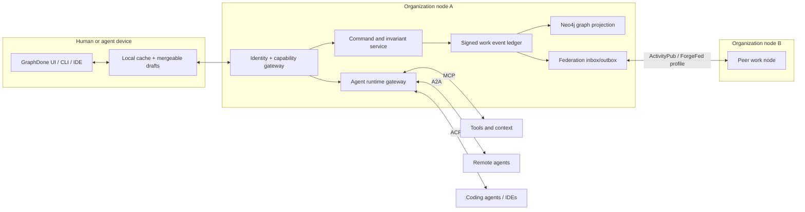

# Decentralized, agent-native work management landscape

> **Research update (2026-09-28):** This was the first landscape pass and still frames the answer too closely around GraphDone and a federated work graph. Read it as a source inventory and comparator review. The later [Beyond GraphDone synthesis](./beyond-graphdone-coordination-fabric.md) replaces that product thesis with a federated commitment and situation fabric in which tasks and graphs are derived views.

**Prepared:** 2026-09-28  
**Focus:** GraphDone and a future work-management platform for developers, humans, and AI agents  
**Evidence:** primary repositories and documentation, standards, research papers, and a small set of publicly indexed practitioner posts

## Executive conclusion

GraphDone has a credible product thesis: work is a dependency graph, humans and agents are peers, and coordination should emerge from outcomes instead of a manager-maintained hierarchy. Its public implementation already has a useful graph interface, Neo4j storage, GraphQL, and MCP.

The strongest opportunity is to turn that graph into a **portable work protocol and execution ledger**. Each team can host a node. People and agents can work locally, exchange selected graph objects between nodes, and preserve attribution, decisions, evidence, and dependencies.

This produces a clearer position than “decentralized Jira”:

> **GraphDone is a federated work graph where people and agents coordinate goals, dependencies, execution, and evidence across organizational boundaries.**

The recommended architecture combines:

1. **A self-hosted organizational node** for policy, private data, search, and projections.
2. **A signed event model** as the portable representation of every meaningful work change.
3. **Local-first editing where it helps**, especially drafts, descriptions, comments, and personal views.
4. **Federation between nodes** for selected goals, work items, dependencies, artifacts, and status events.
5. **Leased execution and approval gates** for agent actions that require exclusive ownership or external effects.
6. **MCP for tools and context, A2A for delegation, ACP for coding-agent sessions, and ForgeFed/ActivityPub concepts for federation.**
7. **Neo4j as a graph projection initially**, with the signed event history kept stable and independent of the current database layout.

Avoid a blockchain in the initial architecture. The product needs portable identity, verifiable attribution, access control, conflict handling, and replication. A token or global consensus network does not solve the main collaboration problems and adds governance, privacy, latency, and operational costs.

## What “decentralized” means

These properties are different and should be named separately in product copy and architecture decisions.

| Property | Meaning | Current GraphDone status | Recommended target |
|---|---|---:|---:|
| Open source | Users can inspect, modify, and redistribute the code | Yes, MIT | Keep |
| Self-hosted | A team controls its own application and database | Yes | Production hardening |
| Data portable | Users can export useful objects without losing relationships and history | Partial/unclear | Stable event and snapshot formats |
| Local-first | A device remains useful offline and syncs later | No public evidence | Selective local-first support |
| Federated | Independent servers exchange authorized work objects | No | Primary decentralization goal |
| Peer-to-peer | Devices exchange state without an authoritative server | No | Optional later mode |
| Cryptographically attributable | Changes can be verified independently of the transport | No public evidence | Signed actors and events |
| Governance decentralized | Policy decisions are not controlled by one operator | Democratic ratings inside an instance | Workspace and federation governance policies |

Self-hosting gives sovereignty over one installation. Federation creates collaboration across installations. Local-first gives resilience and user ownership on devices. Peer-to-peer operation is the most complex option because privacy, revocation, availability, search, and organizational policy become harder.

## Research method and limits

### Repository scan

The scan used GitHub repository and topic searches for:

- project management, issue tracking, kanban, and self-hosted work management;
- local-first, offline-first, peer-to-peer, federated, and decentralized task systems;
- MCP, agent-native project management, agent control planes, and human-agent work boards;
- ForgeFed, distributed issue tracking, Git-native issues, and decentralized forges.

Repositories were included when they had meaningful adoption, a distinctive architecture, protocol relevance, or direct product overlap. License files, recent activity, documentation, and repository descriptions were checked from primary sources. GitHub stars below are a snapshot from 2026-09-28 and measure attention rather than product quality.

### Paper scan

The paper corpus uses foundational local-first and CRDT papers, recent access-control work, systematic reviews, primary agent coordination studies, and empirical studies of coding agents in open source. Citation chaining and the CRDT bibliography were used to broaden coverage.

This is a structured landscape review, not a claim that every publication was read. A reproducible systematic literature review would also require a locked query protocol, deduplication, inclusion decisions from bibliographic databases such as ACM DL, IEEE Xplore, Scopus, and Web of Science, two-reviewer screening, and a PRISMA flow diagram.

### Articles and X

Publicly indexed X posts were used for discovery and practitioner signals. Search engines cannot expose all X content, including deleted, private, unindexed, or login-gated posts. Product and architecture claims below rely on repositories, specifications, or papers where possible.

## GraphDone today

Primary source: [GraphDone-Core](https://github.com/GraphDone/GraphDone-Core)

The public repository describes:

- work as nodes and typed relationships in a living graph;
- outcomes, tasks, milestones, and dependencies;
- democratic prioritization and resource migration;
- humans and AI agents as first-class participants;
- Neo4j 5 with APOC as the graph database;
- GraphQL as the application API;
- an MCP server connected to Neo4j;
- a React interface and self-hosted deployment;
- an MIT license.

### What is already differentiated

1. **Dependency flow is the primary interface.** This is a stronger product idea than adding a graph view to a list-based tracker.
2. **Human and agent access share the same domain.** MCP and GraphQL already let agents operate on the same objects as people.
3. **Outcomes and contribution can span levels.** This supports goal-to-task traceability better than flat ticket tools.
4. **The product has an explicit governance view.** Democratic validation and emergent priority are unusual in mainstream work managers.

### Architectural gaps to close

1. **One Neo4j database is still one authority.** Remote access to that database or API is distributed deployment, not federation.
2. **The graph model needs a stable wire format.** Database labels and relationships should not become the public protocol by accident.
3. **MCP is not a federation protocol.** It exposes tools and context to an agent client; it does not define cross-instance ownership, replication, subscriptions, or conflict resolution.
4. **Agents need execution semantics.** Assignment alone is insufficient. The platform needs claims or leases, cancellation, retries, budgets, approvals, evidence, and idempotency.
5. **Democratic priority needs a threat model.** Ratings across nodes require identity, membership, reputation or policy boundaries, anti-Sybil rules, and explainable aggregation.
6. **Offline edits need conflict rules.** Some graph changes merge cleanly; exclusive assignment, budget spending, and lifecycle transitions require stronger coordination.
7. **Direct database credentials should disappear from agent setup.** Agents should receive narrow, revocable capabilities through an authenticated gateway.

## Market map

### Mature open-source work-management products

These projects are strong references for product scope, UX, imports, permissions, and operations. Most are self-hostable centralized applications.

| Project | Stars | License | Relevant strengths | Decentralization |
|---|---:|---|---|---|
| [Plane](https://github.com/makeplane/plane) | 60.0k | AGPL-3.0 | Modern Linear-style issues, cycles, modules, pages, views | Self-hosted |
| [Huly](https://github.com/hcengineering/platform) | 27.8k | EPL-2.0 | Integrated work platform, chat, documents, issue tracking, Yjs collaboration | Self-hosted; local collaboration components |
| [OpenProject](https://github.com/opf/openproject) | 16.2k | GPL-3.0 | Mature governance, enterprise PM, roadmaps, time and cost controls | Self-hosted |
| [Wekan](https://github.com/wekan/wekan) | 21.1k | MIT | Mature Kanban, broad integrations | Self-hosted |
| [Kanboard](https://github.com/kanboard/kanboard) | 9.9k | MIT | Small, stable Kanban core and plugin model | Self-hosted |
| [Leantime](https://github.com/Leantime/leantime) | 11.7k | AGPL-3.0 | Strategy, goals, projects, and team planning | Self-hosted |
| [Vikunja](https://github.com/go-vikunja/vikunja) | 5.5k | AGPL-3.0 | Tasks, lists, Kanban, CalDAV, approachable deployment | Self-hosted |
| [Kaneo](https://github.com/usekaneo/kaneo) | 9.3k | MIT | Lightweight modern issue tracking | Self-hosted |
| [Worklenz](https://github.com/Worklenz/worklenz) | 3.2k | AGPL-3.0 | Projects, resources, time, analytics | Self-hosted |
| [Nextcloud Deck](https://github.com/nextcloud/deck) | 1.4k | AGPL-3.0 | Work boards inside a federated/cloud collaboration ecosystem | Self-hosted; Nextcloud ecosystem |
| [ERPNext](https://github.com/frappe/erpnext) | 39.6k | GPL-3.0 | Projects joined to business operations and accounting | Self-hosted, broader ERP |

Other historically or operationally relevant systems include [Redmine](https://www.redmine.org/), [Taiga](https://github.com/taigaio), [GanttProject](https://github.com/bardsoftware/ganttproject), [DooTask](https://github.com/kuaifan/dootask), [Tasks.md](https://github.com/BaldissaraMatheus/Tasks.md), and [Taskcafe](https://github.com/JordanKnott/taskcafe). Taskcafe is useful historically but its upstream has been quiet.

### Workspaces and knowledge systems with task features

| Project | Stars | License status | Why it matters |
|---|---:|---|---|
| [AppFlowy](https://github.com/AppFlowy-IO/AppFlowy) | 77.0k | AGPL-3.0 | Local-first workspace, documents, databases, extensibility |
| [AFFiNE](https://github.com/toeverything/AFFiNE) | 73.0k | Split: MIT outside restricted backend/native areas | Local-first collaborative workspace and CRDT engineering; inspect component licenses before reuse |
| [Docmost](https://github.com/docmost/docmost) | 21.8k | AGPL-3.0 | Collaborative knowledge base that can hold durable project context |
| [Anytype](https://github.com/anyproto/anytype-ts) | 8.9k | Any Source Available 1.0, non-OSI | Strong local-first and peer-to-peer product reference; client is source available rather than open source |

### License and maintenance cautions

- [Focalboard](https://github.com/mattermost-community/focalboard) has 26.5k stars but its repository says it is unmaintained. Source licensing mixes AGPL, Apache-2.0 exceptions, and commercial terms.
- [PLANKA](https://github.com/plankanban/planka) has 12.6k stars. Its current PLANKA Community License/Fair Use License is not a standard OSI open-source license. Treat it as source available when selecting reusable code.
- Anytype’s own license FAQ says its apps are source available and the license is not OSI approved. Its protocols and infrastructure may use permissive licenses separately.
- Repository-level license labels can hide split licensing. Verify the exact directory and version before incorporating code.

### Developer forges and distributed issue systems

| Project/protocol | Adoption | What to learn | Model |
|---|---:|---|---|
| [Gitea](https://github.com/go-gitea/gitea) | 58.2k stars, MIT | Fast self-hosting, issues, PRs, packages, actions | Centralized per instance |
| [Forgejo](https://codeberg.org/forgejo/forgejo) | Major community fork | Community governance and forge federation direction | Self-hosted, federation work |
| [OneDev](https://github.com/theonedev/onedev) | 15.3k stars, MIT | Integrated code, CI, issues, packages | Centralized per instance |
| [git-bug](https://github.com/git-bug/git-bug) | 10.6k stars, GPL-3.0 | Issues as distributed Git objects, offline work, bridges | Distributed via Git |
| [Fossil](https://fossil-scm.org/) | Long-running project | DVCS, wiki, tickets, forum in one replicated artifact | Distributed DVCS |
| [git-issue](https://github.com/dspinellis/git-issue) | Small/historic | Minimal text issues carried with Git | Distributed via Git |
| [Bugs Everywhere](https://bugs-everywhere.readthedocs.io/) | Historic | Lessons from embedding tickets in DVCS | Distributed via DVCS |
| [ForgeFed](https://forgefed.org/spec/) | Specification, limited implementation | Project, Ticket, Task/Issue, merge request, dependencies, milestones, reviews over ActivityPub | Federation |
| [Radicle Heartwood](https://github.com/radicle-dev/heartwood) | 267 GitHub mirror stars | Signed identities, peer-to-peer Git, collaborative objects for issues and patches | Local-first P2P |

[Radicle’s protocol guide](https://radicle.dev/guides/protocol) is the clearest production-oriented reference for signed, local-first collaboration objects. It should be studied as an architecture, not adopted blindly. A [2026-09-23 security disclosure](https://radicle.dev/2026/09/23/disclosure-of-vulnerability-in-network-protocol) warns about a network-protocol vulnerability affecting released versions; GraphDone should wait for fixed releases and an independent security review before using Radicle for private data.

## Agent-native work management

This category changed quickly during 2026. These projects are more direct competitors and design references than classic Kanban tools.

| Project | Stars | License | Primary idea | Maturity signal |
|---|---:|---|---|---|
| [Paperclip](https://github.com/paperclipai/paperclip) | 90.2k | MIT | Company-like control plane for agent teams: goals, org chart, budgets, heartbeats, approvals, audit, workspaces | Very high attention; active; fast-moving |
| [CCPM](https://github.com/automazeio/ccpm) | 8.4k | MIT | Agent skill turns PRDs into GitHub issues and parallel Git worktrees with traceability | Popular workflow layer, GitHub-dependent |
| [Mission Control](https://github.com/builderz-labs/mission-control) | 6.3k | MIT | Self-hosted control plane for tasks, runs, costs, evidence, memory, MCP/REST/WebSocket/SSE | Alpha, active |
| [Paca](https://github.com/Paca-AI/paca) | 1.9k | Apache-2.0 | Humans and agents on one Scrumban board; BDD, system design, MCP/ACP, sandboxes, WASM plugins | Direct product comparator, active |
| [Chorus](https://github.com/Chorus-AIDLC/Chorus) | 1.2k | AGPL-3.0 | Structured human-agent software lifecycle and orchestration | Emerging |
| [itsaplan](https://github.com/croffasia/itsaplan) | 840 | AGPL-3.0 | Linear/Plane-style tracker for humans and agents | Emerging, active |
| [Veritas Kanban](https://github.com/BradGroux/veritas-kanban) | 834 | MIT | Lightweight Kanban for agent orchestration and verification | Emerging |
| [PAD](https://github.com/PerpetualSoftware/pad) | 182 | Apache-2.0 | Planning and delegation surface for coding agents | Early |
| [Orbit](https://github.com/Noveum/orbit) | 49 | Apache-2.0 | MCP-native project management and self-hosting | Preview/early |
| [Pith](https://github.com/SiluPanda/pith) | 9 | MIT | Human and agent task board, MCP-first | Very early |

Other early systems worth monitoring rather than depending on include Plan Desk, MyMir, GraphClaw, TaskGraph, agent-kanban, task-orchestrator, DSH Taskboard, and Project Butler. Their concepts are useful, but adoption and compatibility are not yet stable enough for core dependencies.

### What the leading agent products teach

**Paperclip** treats agents as an organization. Its strongest mechanisms are atomic task checkout, persistent run state, budget enforcement, heartbeat scheduling, approval gates, scoped secrets, artifacts, and durable activity. GraphDone should match the safety semantics while keeping its graph and cross-organization focus.

**Mission Control** distinguishes logs from proof of completion. It combines tasks, run inspection, spend, approvals, evals, completion receipts, and multiple interfaces. GraphDone needs an explicit `Evidence` or `CompletionReceipt` object rather than allowing an agent to mark itself done with a status change.

**Paca** gives humans and agents the same Scrum board and adds BDD, design documents, QA agents, ACP bridges, isolated execution, diff/revert, and capability-scoped WASM plugins. It is the closest reference for equal human-agent participation.

**CCPM** keeps specifications and progress in files and GitHub issues and uses worktrees for parallel work. Its portable lesson is end-to-end traceability: `goal → specification → plan → work item → run → change → verification`.

## Standards and protocols

| Standard | Use in GraphDone | What it does not solve |
|---|---|---|
| [ActivityPub](https://www.w3.org/TR/activitypub/) | Federation transport patterns: actors, inbox, outbox, activities, addressing | Work-domain semantics, private group authorization, conflict rules |
| [ForgeFed](https://forgefed.org/spec/) | Starting vocabulary for projects, tickets, dependencies, milestones, reviews, and merge requests | Broad product UX; implementation maturity is limited |
| [OSLC Change Management 3.0](https://www.oasis-open.org/standard/oslc-change-management-version-3-0/) | Enterprise interoperability for change requests and linked lifecycle resources | Offline sync and agent execution |
| [Model Context Protocol](https://github.com/modelcontextprotocol/modelcontextprotocol) | Expose context, resources, prompts, and narrow tools to agents | Agent-to-agent delegation and server federation |
| [A2A Protocol](https://github.com/a2aproject/A2A) | Discover agents, create long-running tasks, stream status, exchange artifacts | Work graph ownership and human product UX |
| [Agent Client Protocol](https://github.com/agentclientprotocol/agent-client-protocol) | Connect coding agents to editors and work surfaces, including sessions and permissions | General federation or organization policy |
| [AGENTS.md](https://agents.md/) | Repository-scoped instructions for coding agents | Runtime permissions or durable work state |
| [iCalendar VTODO, RFC 5545](https://www.rfc-editor.org/rfc/rfc5545) | Basic task/calendar import and export | Dependency graphs and execution provenance |
| [W3C PROV-O](https://www.w3.org/TR/prov-o/) | Vocabulary for entities, activities, agents, derivation, and attribution | Operational task protocol |
| [CloudEvents](https://cloudevents.io/) | Standard event envelope for webhooks and internal buses | Domain objects and authorization |
| [UCAN](https://github.com/ucan-wg/spec) | Capability delegation concepts for agents and cross-node actors | Complete organizational access model |

### Recommended protocol split

- **GraphDone Work Protocol:** the stable domain schema, event types, state-machine rules, conflict semantics, and signatures.
- **ActivityPub/ForgeFed profile:** inter-node discovery, addressing, inbox/outbox delivery, follow/subscription, and selected public/shared work.
- **MCP server:** agent tools and contextual resources within the permissions of one actor.
- **A2A gateway:** remote delegation to long-running agents and artifact exchange.
- **ACP adapter:** interactive coding sessions launched from a work item.
- **OSLC adapter:** import/export and links for enterprise engineering tools.

One protocol should not be stretched to cover all five roles.

## Research synthesis

### Local-first and replicated data

1. [Local-First Software](https://www.inkandswitch.com/essay/local-first/) defines seven ideals: fast local interaction, multi-device operation, offline work, collaboration, longevity, privacy, and user control. It also explains why cloud-only collaboration weakens ownership.
2. [A Conflict-Free Replicated JSON Datatype](https://martin.kleppmann.com/2017/04/24/json-crdt.html) provides a basis for synchronizing JSON-like application state under concurrency.
3. [Peritext](https://www.repository.cam.ac.uk/items/8828fef6-b774-4597-ab83-c553b7e3f7f9) addresses rich-text CRDT semantics, which matter for issue descriptions and collaborative documents.
4. [Collabs](https://arxiv.org/abs/2212.02618) shows how reusable CRDT components can build collaborative applications without inventing every replicated data type.
5. [Verifying Strong Eventual Consistency](https://arxiv.org/abs/1707.01747) demonstrates that convergence claims should be proved against a formal model rather than inferred from tests.
6. [Byzantine Eventual Consistency](https://arxiv.org/abs/2012.00472) and [Making CRDTs Byzantine Fault Tolerant](https://martin.kleppmann.com/2022/04/05/bft-crdt-papoc.html) matter when federated peers may be buggy or malicious.
7. [Consistent Local-First Software](https://programming-group.com/assets/pdf/papers/2024_Consistent-Local-First-Software-Enforcing-Safety-and-Invariants-for-Local-First-Applications.pdf) focuses on preserving safety and invariants, a central problem for budgets, unique claims, and dependency constraints.
8. [Keyhive](https://www.inkandswitch.com/keyhive/notebook/) explores decentralized authorization for local-first applications. It is valuable research, while its notebook also shows that usable access control remains a hard and evolving problem.
9. [Towards System-Oriented Formal Verification of Local-First Access Control](https://arxiv.org/abs/2604.23560) reinforces the need to verify authorization as part of the whole replicated system.
10. [Acumen](https://www.usenix.org/conference/osdi26/presentation/cottone) is relevant for accountable, encrypted collaborative editing.
11. The [CRDT paper index](https://crdt.tech/papers.html) is the broader bibliography for continued study.

**Product implication:** use CRDTs for concurrently edited content and grow-only observations. Use leases, authority boundaries, or coordinated transactions for scarce resources and irreversible effects. A universal CRDT graph would make important business invariants difficult to explain and enforce.

### Agentic project management and software engineering

1. [Toward Agentic Software Project Management: A Vision and Roadmap](https://arxiv.org/abs/2601.16392) proposes progressive autonomy and a human-centered project-management role for agents.
2. [Generative AI for IT Project Management: A Systematic Review](https://www.mdpi.com/2079-8954/14/6/722) finds fragmented evidence and recommends process-specific, role-based, hybrid human-guided agent architectures.
3. [LLM-Based Multi-Agent Systems for Software Engineering](https://doi.org/10.1145/3712003) maps multi-agent work across the software lifecycle and identifies agent capability and coordination gaps.
4. [ChatCollab](https://arxiv.org/abs/2412.01992) studies humans and AI agents as peers in software teams.
5. [MetaGPT](https://arxiv.org/abs/2308.00352) uses roles and standard operating procedures to structure multi-agent software work. Its value is the structured artifacts and interfaces between roles.
6. [RTADev](https://aclanthology.org/2025.findings-acl.80/) focuses on intention alignment between humans and agents in software development.
7. [Planning with Multi-Constraints](https://aclanthology.org/2025.coling-main.672/) is relevant to decomposing work under dependencies and operational constraints.
8. [MultiAgentBench](https://arxiv.org/abs/2503.01935) evaluates collaboration and competition among LLM agents.
9. [DPBench](https://arxiv.org/abs/2602.13255) exposes deadlocks and failures in simultaneous coordination.
10. [Single-Agent or Multi-Agent?](https://arxiv.org/abs/2505.18286) examines when extra agents help enough to justify coordination cost.
11. [Passes Alone, Fails Together](https://arxiv.org/abs/2609.25396) constructs semantic coordination failures that appear only when individually capable agents interact.
12. [Verification-Aware Planning](https://aclanthology.org/2026.eacl-long.353/) supports planning around checkable intermediate outcomes.
13. [Context Engineering for AI Agents in Open-Source Software](https://arxiv.org/abs/2510.21413) studies repository instruction practices across hundreds of projects.
14. [How AI Coding Agents Modify Code](https://arxiv.org/abs/2601.17581) analyzes a large corpus of agent-authored pull requests.
15. [When Code Authors Are Agents](https://doi.org/10.1145/3805760.3814909) compares 40,214 pull requests across 2,807 repositories, including 33,596 agent-authored contributions.
16. [On Autopilot?](https://doi.org/10.1145/3793302.3793573) studies review practices around autonomous code contributions.
17. [An Exploratory Study of Agent Plans](https://arxiv.org/abs/2608.04661) investigates task-oriented plan artifacts in open-source repositories.
18. [TheAgentCompany](https://openreview.net/pdf?id=LZnKNApvhG) provides a self-hostable simulated company environment and evaluators for consequential workplace tasks.
19. [DevNous](https://www.sciencedirect.com/science/article/pii/S0950584926000674) studies a multi-agent system that grounds IT project management in long, path-dependent team conversations.
20. [Cognitive Agents for Agile Software Project Management](https://www.mdpi.com/2079-9292/14/1/87) applies role-based cognitive agents to scaled agile practices.

**Product implication:** a large agent swarm should not be the default. Start with one accountable executor per work claim and one independent verifier when risk justifies it. Parallelize nodes only after the dependency graph demonstrates they are independent. Record coordination cost, retries, blocked time, token spend, and evidence quality so the system can learn when parallelism helps.

### Human-agent design principles supported by the corpus

- Make plans, decisions, and artifacts visible outside chat transcripts.
- Give every action an attributable actor and bounded capability.
- Preserve the link from organizational goal to work item to run to evidence.
- Allow interruption, reassignment, rollback, and expiration.
- Require independent verification for costly, external, or security-sensitive effects.
- Track uncertainty and unresolved assumptions as first-class state.
- Evaluate team outcomes and coordination costs, not only single-agent task success.
- Use deterministic checks before model-based review where possible.

## Practitioner and X signals

These are directional observations, not peer-reviewed evidence.

- [Nick Spisak on Claude Code “Ultraplan”](https://x.com/NickSpisak_/status/2042993832531275882) reports parallel planning and critic-agent workflows. The post also says speed gains did not reliably improve quality and highlights browser review.
- [Dominik Kundel on MCP, skills, and Linear](https://x.com/dkundel/status/2018436269907603590) illustrates how existing trackers become agent-operable through connectors and reusable skills.
- [Blake Anderson announcing Core](https://x.com/blakeandersonw/status/2038276867464061056) signals demand for one open workspace spanning Slack, Linear, Notion, and agents. The public X announcement is clearer than currently discoverable primary repository metadata, so Core is treated as an emerging signal rather than a verified dependency.
- [sysls on long-running agent workflows](https://x.com/systematicls/status/2038241033755168959) emphasizes explicit contracts, decomposition, independent verification, and telemetry.
- Public discussion around Paperclip shows strong interest in organizational abstractions, budgets, goals, and audit for agent fleets; its repository now provides stronger evidence than social posts.

## Recommended product design

### Core domain objects

| Object | Purpose |
|---|---|
| `Actor` | Human, agent, service, or organization identity |
| `Workspace` | Policy and privacy boundary hosted by a node |
| `Goal` / `Outcome` | Desired state with measures and ownership |
| `WorkItem` | Executable unit of work with lifecycle and constraints |
| `Relation` | Typed edge: blocks, depends-on, contributes-to, duplicates, validates, supersedes |
| `Claim` / `Lease` | Exclusive or shared right to execute work until expiry |
| `Plan` | Versioned decomposition, assumptions, constraints, and checkpoints |
| `Run` | One agent or human execution attempt with status and resource use |
| `Artifact` | Code, document, dataset, deployment, design, message, or external result |
| `Evidence` | Tests, screenshots, logs, review, measurements, or signatures proving completion |
| `Decision` | Chosen option with rationale, alternatives, and affected graph nodes |
| `CapabilityGrant` | Narrow permission with issuer, subject, resources, actions, expiry, and revocation |
| `Event` | Immutable, attributable change used for history, sync, and audit |

### Event envelope

Every meaningful state change should have a canonical envelope similar to:

```json
{
  "id": "urn:graphdone:event:01J...",
  "type": "WorkItemClaimed",
  "object": "urn:graphdone:work:01J...",
  "actor": "did:key:z6Mk...",
  "workspace": "https://team.example/workspaces/product",
  "occurredAt": "2026-09-28T10:30:00Z",
  "causationId": "urn:graphdone:event:01J...",
  "correlationId": "urn:graphdone:run:01J...",
  "expectedVersion": 17,
  "payload": {
    "leaseUntil": "2026-09-28T11:00:00Z",
    "scope": ["read", "comment", "attach-artifact"]
  },
  "signature": "..."
}
```

Use globally unique IDs, versioned JSON Schema, deterministic serialization for signatures, idempotency keys, causation/correlation IDs, and explicit schema migration rules. Make ActivityStreams/ForgeFed mappings an adapter so the internal event model is not limited by those vocabularies.

### Consistency rules

| Data/change | Recommended consistency |
|---|---|
| Description, notes, comments | CRDT or mergeable operation log |
| Tags, watchers, reactions | Add/remove sets with tombstones |
| Personal layouts and filters | Device-local first, optional sync |
| Dependency creation | Optimistic change plus deterministic validation; cycles can be rejected or modeled explicitly |
| Work claim | Authoritative lease issued by the owner node |
| Budget reservation/spend | Coordinated transaction at the budget authority |
| Approval | Signed decision from an authorized actor |
| External side effect | Idempotent command plus durable result/evidence |
| Public/federated status | Signed event with per-peer delivery and replay |
| Search and graph visualization | Eventually consistent projections |

### Reference architecture



### Agent execution contract

1. An actor creates or derives a work item from a goal.
2. A planner proposes a plan, dependencies, risks, and completion criteria.
3. Policy decides whether a human approval is required.
4. An executor obtains a time-bounded claim with scoped capabilities and budget.
5. The run emits progress events and stores artifacts outside the model transcript.
6. Deterministic checks run first.
7. A separate verifier reviews evidence when policy requires it.
8. An authorized actor accepts, rejects, or requests changes.
9. Completion updates dependent nodes and may wake newly unblocked work.
10. The system retains cost, time, retries, decisions, and evidence for later evaluation.

### Human experience

The graph should answer five questions without opening a chat transcript:

1. What outcome are we pursuing?
2. What is blocked, and by which dependency?
3. Who or what currently owns each piece of work?
4. What changed, why, and under whose authority?
5. What evidence supports “done”?

Provide list, board, timeline, inbox, and graph projections over one domain. Most users should not have to manipulate a large force-directed graph for routine triage.

## Build strategy

### Phase 0: protocol and safety foundation

- Define the actor, work-item, relation, run, artifact, evidence, decision, and event schemas.
- Write state machines and invariants for claim, execute, review, approve, and close.
- Put authentication and capability checks in front of GraphQL and MCP.
- Add idempotency, event attribution, and an audit view.
- Publish architecture decision records for federation, identity, signatures, and conflict rules.

### Phase 1: the best shared board for humans and agents

- Add agent identities, health, current claim, run history, and cost.
- Add lease-based claims so two agents do not silently duplicate exclusive work.
- Add completion criteria, artifacts, evidence, independent verification, and approval gates.
- Add worktree or sandbox adapters for coding agents.
- Add MCP resources/tools and ACP/A2A adapters behind the same capability service.
- Measure claim time, blocked time, retries, review failures, cost, and accepted output.

### Phase 2: portable and local-first work

- Version and publish the work-event JSON schemas.
- Add signed export/import with stable object IDs and full relationship preservation.
- Add an offline cache for selected graphs.
- Use CRDTs for descriptions/comments and deterministic merge policies for simple metadata.
- Keep exclusive claims, approvals, and budgets authoritative at the workspace node.

### Phase 3: federation

- Run a two-node testbed controlled by separate organizations.
- Implement actor discovery, project subscriptions, inbox/outbox delivery, retries, deduplication, and replay.
- Exchange a small initial set: goals, tickets, typed dependencies, public comments, artifacts by reference, and status events.
- Add allow lists, per-object visibility, remote actor trust, moderation, removal, and key rotation.
- Publish a narrow GraphDone profile of ActivityPub/ForgeFed with conformance fixtures.

### Phase 4: ecosystem

- Create adapters for GitHub, GitLab, Forgejo, Gitea, Linear, Jira, and OSLC systems.
- Publish an SDK for projections and plugins rather than exposing database internals.
- Add portable agent cards, skills, evaluation suites, and organization templates.
- Explore optional peer-to-peer replication only for teams that have a concrete need beyond federation.

## Suggested initial team

| Role | First responsibilities |
|---|---|
| Product/domain lead | Work ontology, user research, governance rules, and product boundaries |
| Distributed-systems engineer | Event model, sync, federation, identity, conflict and replay semantics |
| Backend/platform engineer | Command layer, policy enforcement, GraphQL, event ledger, integrations |
| Agent/runtime engineer | MCP, A2A, ACP, leases, sandboxes, budgets, evidence, evals |
| Frontend/graph engineer | Graph, list, board, inbox, offline cache, accessible interaction |
| Security engineer, initially part-time | Threat model, capability model, key lifecycle, tenant isolation, agent sandbox review |
| Developer relations/community | Protocol docs, fixtures, SDKs, reference integrations, contributor onboarding |

The minimum serious build team is four strong engineers plus a product/domain lead, with regular security review. Federation and local-first behavior are product features that require ongoing engineering ownership.

## Highest-risk assumptions to test

1. **Users prefer dependency-driven coordination.** Test whether teams make better decisions from the graph and whether routine work remains faster in board/list projections.
2. **Democratic priority produces useful allocation.** Run adversarial simulations for popularity bias, collusion, Sybil actors, stale votes, expertise weighting, and minority-critical work.
3. **Agents can share the same lifecycle as humans.** Validate which states and fields truly transfer and where agents need run-specific semantics.
4. **Cross-organization federation creates enough value.** Pilot with two organizations that share a deliverable while retaining private internal plans.
5. **Evidence improves trust.** Compare acceptance and rework rates for status-only completion versus completion receipts with tests, artifacts, and reviewer decisions.
6. **Parallel agents improve outcomes.** Measure total cost and review burden along with wall-clock time.

## Immediate product recommendation

Build the next release around this thin vertical slice:

> A human creates an outcome and dependency graph. An agent claims one ready node with a lease, works in an isolated environment, attaches artifacts and verification evidence, and requests review. A human or verifier accepts it. The signed completion event unblocks a dependent work item on a second GraphDone node.

That demonstration proves the unique system in one flow: graph planning, human-agent parity, safe execution, evidence, and federation. It is a stronger milestone than adding more conventional project-management features.

## Source index

### Core specifications and protocols

- [W3C ActivityPub](https://www.w3.org/TR/activitypub/)
- [ForgeFed specification](https://forgefed.org/spec/)
- [OSLC Change Management 3.0](https://www.oasis-open.org/standard/oslc-change-management-version-3-0/)
- [Model Context Protocol](https://github.com/modelcontextprotocol/modelcontextprotocol)
- [A2A Protocol](https://github.com/a2aproject/A2A)
- [Agent Client Protocol](https://github.com/agentclientprotocol/agent-client-protocol)
- [CloudEvents](https://cloudevents.io/)
- [W3C PROV-O](https://www.w3.org/TR/prov-o/)
- [UCAN specification](https://github.com/ucan-wg/spec)
- [RFC 5545 iCalendar](https://www.rfc-editor.org/rfc/rfc5545)

### Primary product and architecture sources

- [GraphDone-Core](https://github.com/GraphDone/GraphDone-Core)
- [Paperclip](https://github.com/paperclipai/paperclip)
- [Mission Control](https://github.com/builderz-labs/mission-control)
- [Paca](https://github.com/Paca-AI/paca)
- [CCPM](https://github.com/automazeio/ccpm)
- [Plane](https://github.com/makeplane/plane)
- [Huly architecture](https://github.com/hcengineering/platform/blob/develop/ARCHITECTURE_OVERVIEW.md)
- [OpenProject](https://github.com/opf/openproject)
- [AppFlowy](https://github.com/AppFlowy-IO/AppFlowy)
- [git-bug](https://github.com/git-bug/git-bug)
- [Radicle protocol](https://radicle.dev/guides/protocol)
- [Automerge network sync](https://automerge.org/docs/tutorial/network-sync/)

### Continuing literature indexes

- [CRDT papers](https://crdt.tech/papers.html)
- [Local-First Software](https://www.inkandswitch.com/essay/local-first/)
- [LLM multi-agent systems for software engineering review](https://doi.org/10.1145/3712003)
- [Generative AI for IT project management systematic review](https://www.mdpi.com/2079-8954/14/6/722)
