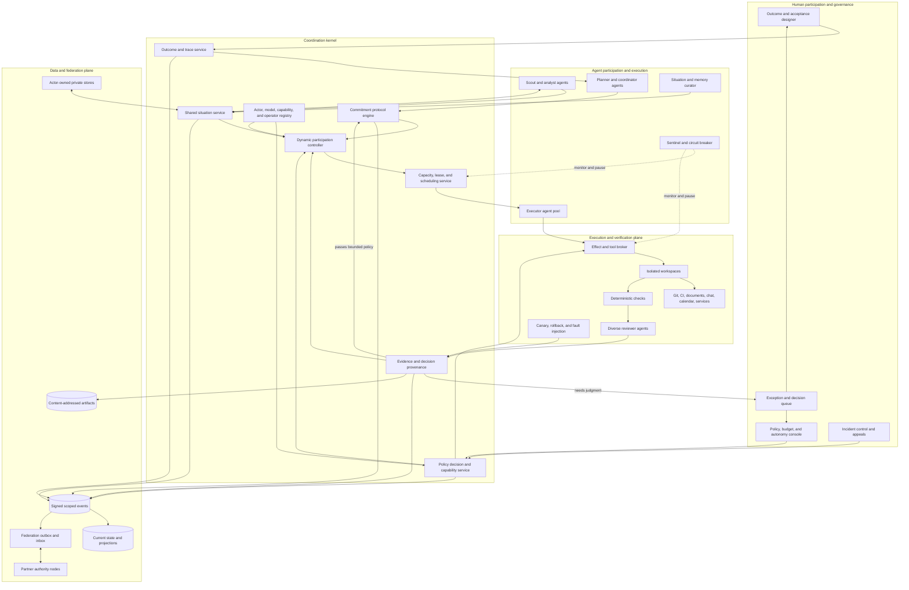
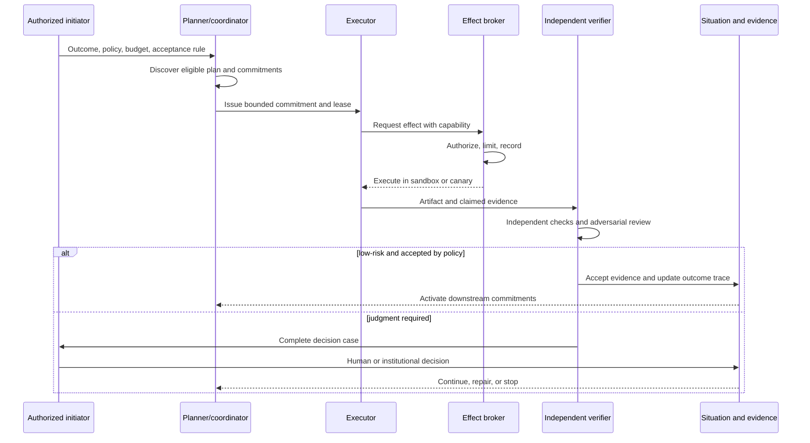

# Dynamic human-agent coordination architecture

**Target:** continuously adapt the human-agent work ratio by scope, risk, evidence, reversibility, capacity, and policy; 90/10, 80/20, 50/50, and human-led modes are all valid operating states  
**Detailed evidence:** [Beyond GraphDone synthesis](./beyond-graphdone-coordination-fabric.md)

## Operating principle

Humans and agents can both define outcomes, plan, coordinate, execute, verify, and govern when authorized. The policy system dynamically assigns each action class to humans, agents, or a mixed protocol. It sends humans complete decision cases when authority, novelty, conflict, impact, or uncertainty requires human judgment.

The architecture protects human attention as a scarce capacity while allowing autonomy to rise when evidence supports it and fall quickly when conditions change. It does not place a human approval dialog in front of every agent action.

## Architecture diagram



## Dynamic participation controller

The human-agent ratio is an observed output of many local allocation decisions. It is not a global slider that assigns a fixed percentage of work to either group.

For each proposed action \(i\), the controller selects:

\[
z_i \in \{human, agent, mixed\}
\]

It minimizes expected completion cost, delay, failure, and attention demand subject to hard constraints:

\[
\min_{z_i} E[cost_i + delay_i + loss_i + attention_i]
\]

subject to:

\[
authorized_i \land safety_i \land evidence_i \land capacity_i
\]

The displayed agent ratio is derived afterward and weighted by impact:

\[
R_A(t) = \frac{\sum_i w_i\,agentShare(z_i)}{\sum_i w_i}
\]

Here \(w_i\) represents consequence, resource consumption, or accepted value. This prevents thousands of automated status updates from hiding the fact that humans still perform all consequential work.

The controller may produce:

| Operating state | Appropriate conditions |
|---|---|
| 90/10 agent-heavy | evaluated, repeatable, reversible work with strong automated evidence |
| 80/20 agent-led | routine execution with periodic human judgment and audit |
| 50/50 collaborative | ambiguous design, changing requirements, or partial evaluation coverage |
| human-led | novel, contested, crisis, governance, or highly irreversible work |

These are descriptions of current operation rather than permanent modes. Different scopes can run at different ratios simultaneously.

Autonomy increases gradually after sufficient successful evidence. It decreases immediately after policy violations, evaluator disagreement, drift, security signals, incident declaration, or loss of rollback readiness. Use hysteresis and minimum observation windows so the allocation does not oscillate with every noisy measurement.

## Dynamic responsibility allocation

| Function | Possible agent participation | Reasons to increase human participation |
|---|---|---|
| observe and summarize | automated collection and synthesis | disputed, sensitive, novel, or low-quality sources |
| define outcomes | propose and refine under delegated policy | value conflict, missing stakeholders, constitutional impact |
| plan and decompose | generate and continuously adapt partial plans | unfamiliar domain or weak causal model |
| allocate work | match capabilities, leases, budgets, and queues | scarce strategic resources or contested allocation |
| negotiate commitments | negotiate within permitted ranges | reserved terms, new counterparty, or material liability |
| execute changes | sandbox, reversible effects, and staged rollout | high blast radius, weak rollback, or legal authority |
| verify evidence | deterministic checks and independent agent review | weak evaluator independence or disputed acceptance |
| change policy | simulate and propose changes | ratification authority and affected-party participation |
| resolve appeals | gather evidence and compare precedent | legitimacy, rights, or value judgment |
| handle incidents | detect, contain, preserve evidence | command decisions and restoration of authority |

## Reference agent cell

A practical first deployment uses four logical agent seats alongside the available human team:

1. **Scout/analyst:** gathers context, records claims, identifies uncertainty, and proposes information-gathering actions.
2. **Planner/coordinator:** produces a partial plan, forms permitted commitments, allocates leases and budget, and reacts to changed evidence.
3. **Executor:** changes code or documents in isolated workspaces through narrow tools.
4. **Verifier/sentinel:** checks policy and outcomes independently, watches costs and loops, and can stop execution.

These are separated roles even when a small deployment reuses a model provider. People may also occupy any of these roles. The controller can scale seats up, down, or to zero for a scope. The executor cannot choose every verifier input, accept its own evidence, expand its permission, or disable the sentinel.

## Autonomy decision

For every proposed effect, compute policy inputs rather than a global “agent trust” score:

```text
actor identity and operator
model/scaffold/tool versions
action class and target
data sensitivity
expected impact and blast radius
reversibility and rollback readiness
novelty relative to evaluated behavior
evidence quality and evaluator independence
current incident and threat state
remaining budget and human attention capacity
```

The policy returns one of:

```text
ASSIGN_HUMAN
ASSIGN_AGENT
ASSIGN_MIXED
ALLOW
ALLOW_IN_SANDBOX
ALLOW_WITH_CANARY
REQUIRE_INDEPENDENT_CHECK
ESCALATE_WITH_DECISION_CASE
DENY
PAUSE_SCOPE
```

## Human decision case

An escalation must arrive as a compact, reviewable case:

```yaml
decision_requested: the exact choice and authority needed
outcome_at_risk: affected desired state
trigger: novelty, conflict, uncertainty, impact, or policy rule
current_situation: supported facts and disputed claims
options:
  - action, expected effect, uncertainty, reversibility, cost
recommendation: selected option with governing policy
evidence: sources, checks, artifacts, provenance
safe_default: what happens if no human responds
deadline: when the decision loses value
capabilities: effects that approval would authorize
```

The human can approve, deny, modify, request information, delegate, or take control. The answer becomes a signed decision and may update future policy only through an explicit separate choice.

## Capacity rule

Let:

- \(n\) be active agents;
- \(r\) be completed units per agent per hour;
- \(p_e\) be the fraction requiring human escalation;
- \(m\) be available qualified humans;
- \(\mu_h\) be resolved cases per human per hour.

Then:

\[
\rho_h = \frac{n r p_e}{m\mu_h}
\]

The control plane should target \(\rho_h \le 0.65\). When predicted load exceeds the boundary, it reduces concurrency, selects lower-risk work, groups related exceptions, or pauses new commitments.

This formula is more useful than a fixed agent-to-human ratio. Four agents doing slow, safe analysis may need less oversight than one agent causing rapid production effects.

Human capacity is one input rather than a reason to raise autonomy unsafely. If qualified human attention is required and unavailable, the safe result is delayed or denied work. The controller may increase agent participation only for action classes already supported by policy and evidence.

## Acceptance pipeline



## Minimum services for version 1

1. outcome and acceptance designer;
2. scoped situation record with claims, uncertainty, and provenance;
3. request, offer, commitment, renegotiation, and discharge engine;
4. actor and agent registry with operator, versions, and evaluations;
5. policy decision point and capability-issuing service;
6. lease, budget, capacity, and human-attention scheduler;
7. dynamic participation controller with promotion, demotion, and hysteresis;
8. sandbox and mediated tool broker;
9. independent verification and evidence service;
10. human exception queue, incident stop control, signed event log, projections, and Git connector.

Use a modular monolith and PostgreSQL first. Keep sandboxes, effect mediation, and signing as hard trust boundaries. Add federation after two real teams validate the ontology and control loop.

## Measures that matter

- accepted agent execution share for eligible work;
- human, agent, and mixed participation by scope and action class;
- impact-weighted autonomous effect share;
- human attention utilization and oldest exception age;
- false acceptance and unnecessary escalation by autonomy tier;
- time from anomaly to containment;
- correlated failure between executor and verifier;
- policy violations blocked before effect;
- accepted value after compute, review, rollback, and rework cost;
- evidence-backed outcome acceptance;
- correction and appeal resolution time.

Task count, token count, comments, online time, agent count, and graph size are operating data rather than success measures.

## First implementation boundary

Build for software and document work:

- GitHub or GitLab repository input;
- documents as context and output;
- isolated coding and research agents;
- deterministic test and policy checks;
- evidence-backed review;
- one unified human work and exception inbox;
- no public federation in the first validation.

The first success test runs comparable real outcomes under agent-heavy, collaborative, and human-led conditions. The controller must reach approximately 90/10 for well-evaluated reversible work, lower autonomy when the environment or evidence changes, keep the human attention queue below its capacity boundary, and preserve the same commitment, evidence, and provenance semantics in every ratio.
