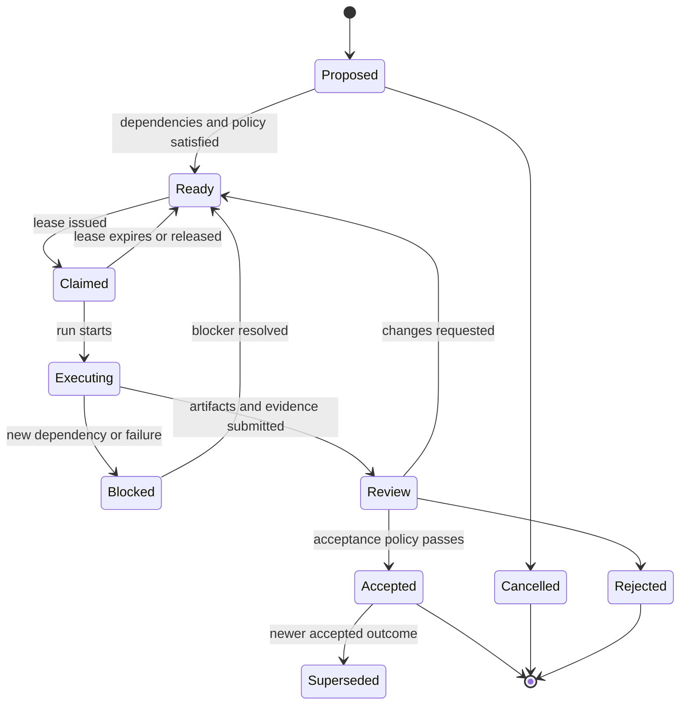
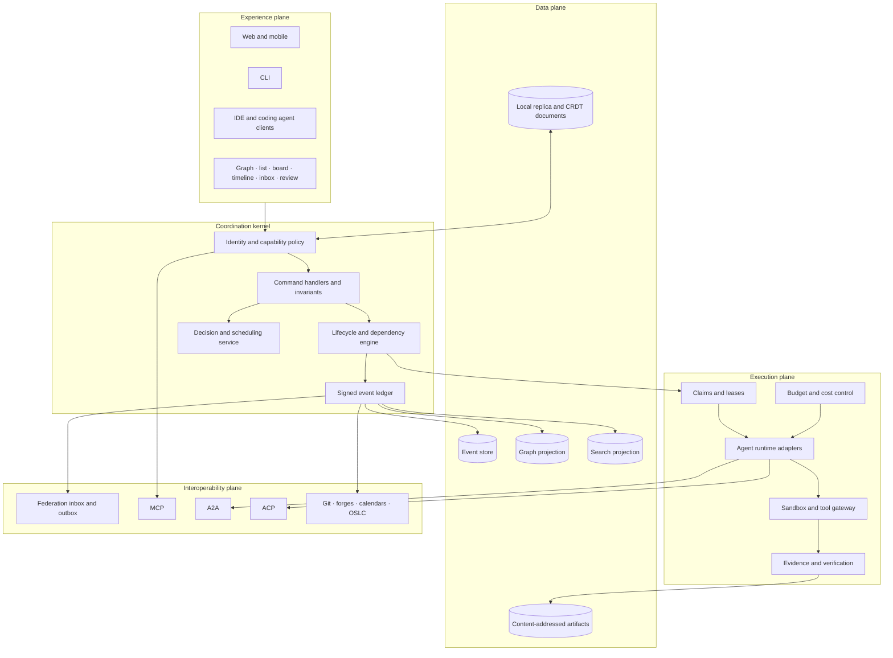
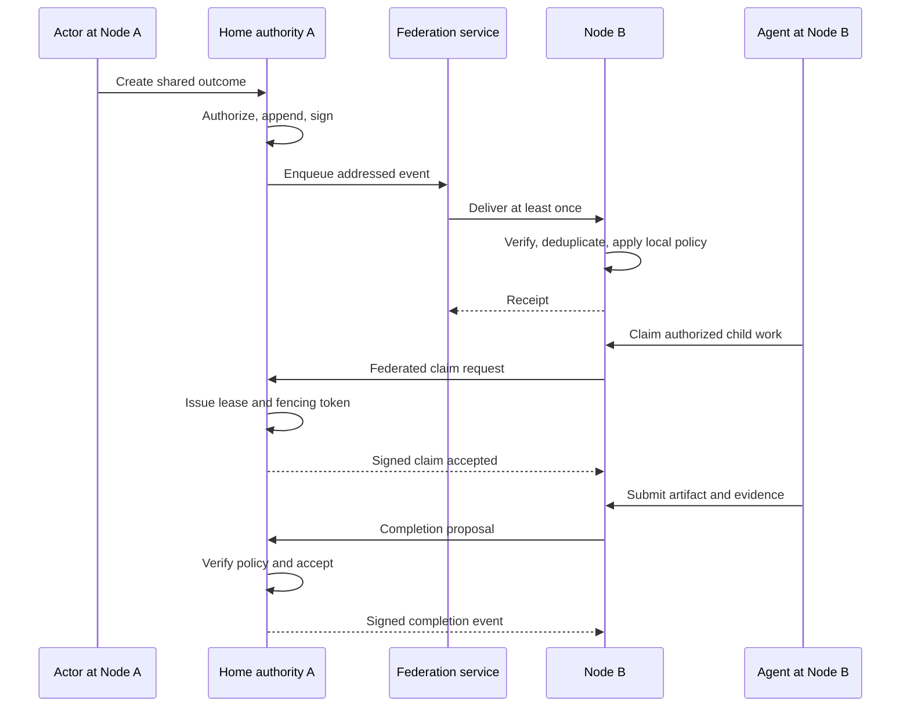
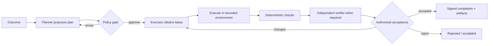

# First-principles architecture for decentralized human-agent work

> **Research update (2026-09-28):** This document develops the mathematical and distributed-systems foundation. The broader CSCW, organizational, human-factors, governance, and multi-agent synthesis in [Beyond GraphDone](./beyond-graphdone-coordination-fabric.md) revises the product center from a work graph to a federated commitment and situation fabric. Treat graphs, tasks, schedules, and rankings below as projections and services within that newer architecture.
>
> **Operating-model update:** The human-agent work ratio is dynamic rather than fixed. Each scope can operate at 90/10, 80/20, 50/50, or human-led modes based on risk, evidence, reversibility, attention capacity, and policy. See the newer synthesis for adaptive autonomy, human-attention capacity, independent verification, and agent-to-agent commitments.

**Prepared:** 2026-09-28  
**Purpose:** design a new work-coordination system from requirements and mathematical foundations  
**Relationship to existing products:** products such as Jira, Linear, Asana, Plane, Paperclip, Paca, and GraphDone are evidence and test cases, not templates

## 1. Design target

Design a coordination system for organizations and networks where:

- humans, AI agents, services, and external organizations all perform work;
- work crosses repositories, applications, teams, and organizational boundaries;
- each organization can host its own node and retain policy control;
- clients can work offline for suitable operations;
- dependencies, decisions, execution, artifacts, and evidence remain connected;
- automated work is constrained, observable, interruptible, and reviewable;
- the system helps people choose and coordinate work without pretending that one universal priority score represents every stakeholder.

The initial scale assumption is 5–500 active actors per organization, hundreds of thousands of work objects, tens of independent organizations in a federation, and bursts of many concurrent agent runs.

## 2. First principles

### 2.1 Work is a state change with evidence

A task description is an intention. Completed work must establish a change in the world and provide evidence that the change satisfies an acceptance policy.

Represent a unit of work as:

\[
W = (S_0, S_*, C, A, P, E)
\]

where:

- \(S_0\) is the observed initial state;
- \(S_*\) is the desired outcome or acceptable set of terminal states;
- \(C\) is the set of constraints;
- \(A\) is the authorized actors and capabilities;
- \(P\) is the proposed or accepted plan;
- \(E\) is the evidence required to accept the transition.

This definition applies to a human writing a policy, an agent changing code, a service deploying software, or an external organization delivering a component.

### 2.2 Coordination is causal ordering under scarcity

Work is constrained by:

- causal dependencies: one fact or artifact must exist before another action is valid;
- resource scarcity: people, agents, compute, money, equipment, attention, and review capacity;
- uncertainty: duration, feasibility, value, risk, and quality are not known exactly;
- authority: only certain actors may commit resources or accept outcomes;
- information: some actions are valuable mainly because they reduce uncertainty.

The platform therefore needs a causal graph, resource model, uncertainty model, and authority model. A visual graph alone is insufficient.

### 2.3 Decentralization is an authority map

“Decentralized” should answer three concrete questions:

1. Who can author a fact?
2. Who is authoritative when concurrent facts conflict?
3. Who may receive the fact?

Every shared object has a home authority. Its home node defines lifecycle rules and access policy. Other nodes hold replicas or references. Some fields merge without coordination; invariant-bound changes go through the home authority.

This model provides organizational sovereignty without requiring every peer to agree on every fact.

### 2.4 Human-agent symmetry has limits

Humans and agents should use the same work objects, attribution model, and collaboration surface. They need different operational controls:

- an agent run needs a budget, runtime, model, tool grants, expiry, and termination mechanism;
- a human assignment usually needs identity, responsibility, and notification;
- high-risk effects may require human approval regardless of the proposed actor;
- trust depends on the actor, task class, evidence, and environment.

The system treats humans and agents as first-class actors while policy remains explicit about their different capabilities.

### 2.5 Optimization follows declared values

There is no objective “best next task” without an objective function, constraints, authority, and risk tolerance. The product should expose these inputs and preserve competing viewpoints.

Default UX should show:

- hard constraints and readiness;
- Pareto-efficient choices;
- why each choice is attractive;
- uncertainty and missing information;
- whose preferences and policies produced the ranking.

An automatic scheduler may choose only when an authorized policy supplies the optimization goal.

## 3. Requirements

### 3.1 Actors

| Actor | Needs |
|---|---|
| Individual contributor | Ready work, context, dependencies, decisions, low-friction updates |
| Product or project lead | Outcomes, alternatives, uncertainty, capacity, progress, risk |
| Reviewer or approver | Changes, evidence, policy, provenance, rollback options |
| AI agent | Machine-readable context, tools, claim protocol, budget, checkpoints, result contract |
| Platform operator | Tenant isolation, policy, cost, observability, recovery, upgrades |
| External partner | Selective sharing, portable identity, limited capabilities, federated status |
| Auditor | Immutable attribution, decision history, evidence, policy version |

### 3.2 Functional requirements

The system must:

1. Model outcomes, work, dependencies, constraints, decisions, risks, actors, resources, runs, artifacts, and evidence.
2. Support typed AND, OR, threshold, temporal, resource, and informational dependencies.
3. Offer graph, list, board, timeline, inbox, decision, and review projections over the same data.
4. Let people and agents propose, claim, execute, verify, review, accept, reject, pause, cancel, and supersede work.
5. Preserve causal history and attribution for every consequential mutation.
6. Enforce capability-based access and policy before tools or external effects are invoked.
7. Support offline drafts and mergeable collaboration.
8. Federate selected objects and events between independently operated nodes.
9. Import and link issues, code changes, documents, messages, calendar items, and external artifacts.
10. Explain readiness, ranking, scheduling, assignment, and policy decisions.
11. Export a workspace with stable IDs, relationships, events, and attachments.
12. Allow a node to leave a federation without losing its own history.

### 3.3 Quality requirements and initial targets

These are hypotheses for validation, not permanent promises.

| Area | Initial target |
|---|---|
| Interactive reads | p95 under 200 ms within a region for ordinary projections |
| Local edits | acknowledged immediately on device; background synchronization |
| Command acceptance | p95 under 500 ms excluding external tools |
| Federation delivery | at-least-once, idempotent, replayable; normal p95 under 60 s |
| Availability | one node failure must not erase signed history held by another authorized replica |
| Audit | every accepted mutation identifies actor, policy version, cause, and request ID |
| Isolation | no cross-workspace read without an explicit grant |
| Accessibility | WCAG 2.2 AA for all primary workflows |
| Portability | complete workspace export/import validated by conformance tests |
| Recovery | deterministic rebuild of projections from snapshots plus accepted events |

### 3.4 Threat model

Assume:

- a user, agent, plugin, remote node, or integration may be compromised;
- messages may be duplicated, delayed, reordered, replayed, or dropped;
- clocks disagree;
- a node may be unavailable or permanently disappear;
- an authorized actor may make a harmful but valid request;
- model output may be incorrect, adversarially influenced, or contain secrets;
- votes and reputation may be manipulated by duplicate identities or coordinated actors;
- attachment and artifact links may later change or disappear.

The initial system does not attempt global Byzantine consensus. It verifies event authorship, applies local policy, assigns home authority, and allows nodes to reject or quarantine remote data.

## 4. Mathematical foundation

### 4.1 Typed directed hypergraph

Use a typed directed attributed hypergraph:

\[
G = (V, H, \tau_V, \tau_H, X)
\]

where:

- \(V\) contains outcomes, work items, decisions, artifacts, evidence, actors, and resources;
- \(H\) contains relationships that may connect several sources to several targets;
- \(\tau_V\) and \(\tau_H\) assign types;
- \(X\) contains versioned attributes.

A hyperedge is necessary for statements such as “A and B together enable C” or “any two of reviewers A, B, and C can approve D.” Converting every condition into ordinary binary edges loses semantics or creates artificial nodes.

### 4.2 Dependency expressions

Each work item \(v\) has a readiness predicate:

\[
ready(v,t)=\phi_v(Z_t) \land policy_v(Z_t) \land capacity_v(Z_t)
\]

where \(Z_t\) is the currently accepted state and \(\phi_v\) is a typed expression containing:

- `allOf`: all prerequisites are satisfied;
- `anyOf`: at least one prerequisite is satisfied;
- `atLeast(k, set)`: threshold dependency;
- `after`, `before`, `during`: temporal relation;
- `requires(resource, amount)`;
- `requiresEvidence(policy)`;
- `requiresDecision(option)`.

The UI may display these as edges, groups, gates, and constraints. The stored semantics remain explicit.

### 4.3 Cycles and strongly connected components

A dependency cycle can mean:

- an invalid plan;
- a legitimate feedback loop;
- mutual negotiation;
- an iterative research or design process.

The system should compute strongly connected components. A pure precedence cycle is rejected. A declared iterative cycle becomes a `CoordinationLoop` with an exit predicate, iteration budget, and review policy. The execution planner condenses each valid strongly connected component into one schedulable meta-node.

### 4.4 Partial order and causal history

Lamport’s [Time, Clocks, and the Ordering of Events](https://www.microsoft.com/en-us/research/publication/time-clocks-ordering-events-distributed-system/) establishes that distributed events naturally form a partial order through the “happened-before” relation.

For events \(e_i\) and \(e_j\):

\[
e_i \rightarrow e_j
\]

means \(e_i\) could have causally influenced \(e_j\). Concurrent events are not forced into a misleading wall-clock sequence.

Use:

- per-object sequence numbers at the home authority;
- Hybrid Logical Clocks for sortable operational timestamps;
- compact version vectors or dotted version vectors where independent replicas must detect concurrency;
- causation and correlation IDs for workflows and agent runs.

Wall-clock time remains metadata and must not determine conflict resolution by itself.

### 4.5 Project scheduling

The Resource-Constrained Project Scheduling Problem schedules dependent activities under limited resources. The literature shows that realistic variants and multiple objectives make this a hard optimization family; [Hartmann and Briskorn](https://www.sciencedirect.com/science/article/pii/S0377221721003982) survey its variants.

For deterministic planning:

- compute earliest and latest feasible times;
- expose critical paths and slack;
- account for calendars and resource capacity;
- use constraint programming or heuristics for resource-constrained schedules;
- state that a schedule is a proposal, not a prediction.

For uncertain duration \(D_v\), store a distribution or quantiles rather than one date. Monte Carlo simulation produces:

\[
P(T_{goal}\le d), \quad P(v\text{ is critical}), \quad E[T_{goal}]
\]

The criticality probability is more useful than one fixed critical path when durations change.

### 4.6 Queueing and WIP

[Little’s Law](https://pubsonline.informs.org/doi/pdf/10.1287/opre.1110.0940) relates average work in progress \(L\), throughput \(\lambda\), and average cycle time \(W\):

\[
L=\lambda W
\]

The product should:

- measure arrival rate, throughput, WIP, waiting time, service time, and blocked time;
- show uncertainty and measurement windows;
- offer WIP policies per bottleneck and work class;
- avoid claiming that one fixed WIP limit is universally optimal;
- distinguish utilization from flow, since running every actor near full utilization can create long queues and delayed feedback.

The system can recommend a WIP experiment, observe cycle time and throughput, and retain the previous policy for rollback.

### 4.7 Bottlenecks, cuts, and unblock value

Use graph cuts only when the model genuinely represents capacity or dependency separation.

For a work item \(v\), estimate its unblock value:

\[
U(v)=\sum_{x\in Desc(v)} w_x P(x\mid v)\,d(v,x)^{-\gamma}
\]

where:

- \(w_x\) is the declared outcome contribution of descendant \(x\);
- \(P(x\mid v)\) is the probability that completing \(v\) makes progress toward \(x\);
- \(d(v,x)\) is graph distance;
- \(\gamma\) discounts distant effects.

Display the components. Do not present this estimate as ground truth.

Cut sets can identify a small group of unresolved dependencies separating current state from an outcome. These are often better intervention candidates than nodes with high visual degree.

### 4.8 Multi-objective choice

Candidate work differs across value, urgency, cost, risk, learning, reversibility, and unblock effect. These dimensions are not naturally commensurable.

Show the Pareto frontier first: a task is dominated when another candidate is no worse on every selected dimension and better on at least one.

When an authorized scheduler must decide, solve an explicit constrained objective such as:

\[
\max_x\;E\left[\sum_o w_oY_o(x)\right]-\lambda_c E[C(x)]-\lambda_r CVaR_\alpha(Loss(x))
\]

subject to:

- dependency and temporal constraints;
- capability and security policy;
- resource and budget limits;
- WIP limits;
- review capacity;
- federation visibility constraints.

The selected weights, risk parameter, policy version, and result explanation are stored with the decision.

### 4.9 Uncertainty and value of information

Represent duration, value, and success as distributions with provenance. A prototype, research spike, or test is worthwhile when its expected value of information exceeds its cost and delay:

\[
EVSI=E[\max_a E[U(a)\mid I]]-\max_a E[U(a)]
\]

Run the information-gathering action when:

\[
EVSI > cost(I)+delayCost(I)
\]

This makes research work visible as uncertainty reduction instead of disguising it as incomplete delivery.

[Bayesian network approaches to project scheduling](https://journals.sagepub.com/doi/pdf/10.1177/875697280703800205) are relevant when duration and risk have causal dependence.

### 4.10 Actor reliability and assignment

Do not maintain one global “agent score.” Performance is conditional on task class, tools, environment, policy, and evidence standard.

For actor \(a\) and task class \(k\), a simple starting posterior is:

\[
p_{a,k}=\frac{\alpha_k+s_{a,k}}{\alpha_k+\beta_k+s_{a,k}+f_{a,k}}
\]

where accepted outcomes are successes and rejected outcomes are failures under a defined evaluation policy. Retain the credible interval and sample size.

An assignment estimate can use:

\[
Q(a,v)=p_{a,k}E[value_v]-E[cost_{a,v}]-\rho E[risk_{a,v}]-\eta E[delay_{a,v}]
\]

Hard capability, privacy, conflict-of-interest, and availability constraints are evaluated before this estimate. Humans must be able to inspect and override the assignment.

### 4.11 Collective prioritization

Simple upvotes reward visibility and can be manipulated. Global anonymous voting is incompatible with strong organizational accountability.

Use scoped participatory budgeting:

- verified members receive a limited preference budget for a defined decision period;
- each allocation identifies its scope and policy while preserving ballot privacy where needed;
- expertise, affected-party status, and formal authority remain separate inputs;
- mandatory compliance, security, and maintenance work cannot be outvoted;
- quorum, abstention, duplicate identity, delegation, and status-quo rules are explicit;
- simulations show how alternative aggregation rules change the result.

Research on [participatory budgeting with constraints](https://link.springer.com/article/10.1007/s00355-023-01462-6) and [safe voting under Sybils and abstention](https://arxiv.org/abs/2001.05271) should inform the governance module.

### 4.12 Feedback control

The work system is a feedback loop:

\[
observe \rightarrow compare \rightarrow decide \rightarrow act \rightarrow measure
\]

Controllers may adjust WIP, agent concurrency, review capacity, or intake. They need:

- bounded control actions;
- hysteresis so small changes do not repeatedly reverse policy;
- rate limits and minimum observation windows;
- delays included in the model;
- rollback and manual override;
- stability tests in simulation.

Distributed resource allocation can oscillate when independent actors react to the same delayed signals. [Holding and Lestas](https://www.sciencedirect.com/science/article/abs/pii/S0005109817303655) give a rigorous example. The product should never auto-reallocate every actor whenever one priority estimate moves.

### 4.13 Petri nets and lifecycle verification

Petri nets provide a formal way to test workflow reachability, deadlock, liveness, and boundedness. [Van der Aalst’s workflow work](https://users.cs.northwestern.edu/~robby/courses/395-495-2017-winter/Van%20Der%20Aalst%201998%20The%20Application%20of%20Petri%20Nets%20to%20Workflow%20Management.pdf) is the relevant foundation.

Compile lifecycle policy into a small Petri-net-like model for verification. Keep the user-facing model as understandable states and transitions.

### 4.14 CALM and coordination boundaries

The [CALM theorem](https://arxiv.org/abs/1901.01930) connects monotonic logic with coordination-free distributed computation.

Practical rule:

- facts that only accumulate can often replicate without coordination;
- decisions that negate, retract, reserve, spend, or establish uniqueness need an authority or coordination mechanism.

Examples:

| Operation | Coordination approach |
|---|---|
| Add a comment or observation | Replicate and merge |
| Attach evidence | Replicate immutable reference |
| Add a tag | CRDT set |
| Edit rich text | CRDT document |
| Claim exclusive work | Home-authority lease |
| Spend budget | Transaction at budget authority |
| Accept outcome | Signed authorized transition |
| Revoke capability | Authority plus expiry and revocation propagation |

## 5. Physics: what is useful

Physics contributes mathematical tools, not proof that organizations behave like physical matter.

### Useful mappings

| Physics/control concept | Valid product use |
|---|---|
| Flow | Throughput of completed work through a defined system boundary |
| Conservation | Budgets, capacity reservations, and other quantities that cannot be duplicated |
| Potential/gradient | A heuristic for distance from declared target state |
| Feedback | Adjust policy based on measured outcomes |
| Damping/hysteresis | Prevent priority and allocation thrashing |
| Phase change | Detect sharp empirical transitions such as overload after review capacity saturates |
| Entropy | Quantify a specific probability distribution’s uncertainty, when such a distribution exists |

### Invalid mappings

- “Energy” should not be an unexplained priority score.
- Graph animation does not demonstrate actual flow.
- Degree or centrality is not automatically importance.
- Organizational consensus is not thermodynamic equilibrium.
- More agents do not create linear throughput; coordination and review are bottlenecks.

The interface may animate observed event rate or forecast flow. It must label modeled, inferred, and measured quantities separately.

## 6. Domain model

### 6.1 Core entities

| Entity | Essential fields |
|---|---|
| `Actor` | stable ID, kind, home node, public keys, memberships, status |
| `Workspace` | home node, policy set, visibility, federation policy |
| `Outcome` | desired state, measures, time horizon, owners, utility model |
| `WorkItem` | initial/target state, lifecycle, task class, constraints, acceptance policy |
| `Dependency` | typed expression, sources, target, strength, rationale, author |
| `Resource` | kind, capacity, calendar, authority, cost model |
| `Decision` | options, criteria, evidence, authority, result, rationale |
| `Risk` | probability model, impact model, signals, mitigations, owner |
| `Plan` | work decomposition, assumptions, schedule, version, proposer |
| `Claim` | actor, scope, lease, fencing token, renewal policy |
| `Run` | runtime, model/tool versions, inputs, budget, checkpoints, outputs, status |
| `Artifact` | immutable digest, media type, location, provenance, visibility |
| `Evidence` | claim tested, method, result, artifact, evaluator, validity period |
| `Review` | subject, reviewer, policy, decision, findings |
| `Capability` | issuer, subject, resource scope, actions, limits, expiry, revocation |
| `Event` | actor, object, command, cause, logical time, policy version, signature |

### 6.2 Work lifecycle



Custom workflows compile to constrained extensions of this semantic lifecycle so integrations can depend on stable meanings.

### 6.3 Non-negotiable invariants

1. Every accepted mutation has an authenticated actor and policy decision.
2. An exclusive claim has at most one valid fencing token at the home authority.
3. An expired claim cannot authorize a new side effect.
4. Budget reservation and spend cannot exceed the authorized limit.
5. `Accepted` requires the evidence and approval defined by the applicable policy version.
6. An artifact referenced as immutable has a verified content digest.
7. A remote event is idempotent and cannot be replayed as a new mutation.
8. A projection can always identify the accepted events and schema versions that produced it.
9. Revoked or expired capabilities fail closed for new commands.
10. Private object content is never included in a federation message without an explicit disclosure grant.

## 7. System architecture

### 7.1 Logical planes



### 7.2 Authoritative writes and projections

The command service is the only path for accepted domain changes. It:

1. authenticates the actor;
2. evaluates capability and workspace policy;
3. loads the authoritative object version;
4. checks state-machine and domain invariants;
5. appends an event with an idempotency key;
6. returns the accepted event or a structured conflict;
7. updates projections asynchronously or transactionally where required.

Graph, board, search, metrics, and timeline are projections. They can be rebuilt. No client or agent writes directly to the graph database.

### 7.3 Storage choice

A pragmatic first implementation uses:

- PostgreSQL for authoritative events, identities, policy, leases, budgets, and federation delivery;
- a transactional outbox in the same database;
- Neo4j or a PostgreSQL graph projection for reachability and graph exploration;
- OpenSearch or PostgreSQL full-text search initially;
- S3-compatible content-addressed artifact storage;
- Automerge or Yjs documents for selected collaborative text;
- SQLite on devices for offline projections and pending operations.

If an existing Neo4j application is evolved rather than rebuilt, append immutable `Event` records and enforce commands in the application layer first. Introduce a separate event store only after migration tooling and dual-write hazards are understood.

### 7.4 Federation

Each object has:

- a globally unique URI;
- a home node;
- an owning workspace;
- visibility and disclosure policy;
- an authoritative version;
- optional signed replicas and subscriptions.

Federation flow:



Use ActivityPub inbox/outbox patterns and a narrow ForgeFed-compatible vocabulary where it fits. Publish a versioned Work Graph Protocol for richer domain semantics.

### 7.5 Local-first boundary

Device-local operations:

- personal views, filters, layout, and draft plans;
- rich-text descriptions and comments;
- cached graph traversal and search;
- pending proposals and evidence capture.

Home-authority operations:

- exclusive claim issuance;
- budget reservation and spend;
- capability grant and revocation;
- acceptance and approval;
- policy changes;
- authoritative identity and membership changes.

This boundary follows the CALM result: merge monotonic knowledge locally; coordinate scarce or revocable rights.

## 8. Agent architecture

### 8.1 Agent contract

Every agent advertises an `AgentProfile`:

- identity and operator;
- supported task classes;
- tools and runtimes;
- input/output artifact types;
- cost and rate limits;
- data residency and privacy properties;
- evaluation history by task class;
- supported MCP, A2A, or ACP versions;
- health and availability.

Every run receives:

- one work item and accepted plan version;
- a time-bounded claim and fencing token;
- scoped capabilities;
- a sandbox or declared execution environment;
- secrets injected only at the authorized tool boundary;
- budget and deadline;
- required checkpoints;
- acceptance and evidence policy.

### 8.2 Plan, execute, verify, approve



Deterministic checks precede model judgment. The verifier should be independent of the executor for high-risk work. The approver sees artifacts, diffs, evidence, uncertainty, cost, and unresolved assumptions.

### 8.3 Parallelism policy

Parallel execution is allowed when:

- dependency expressions show the work is ready;
- write sets or environments are isolated;
- review capacity exists;
- expected wall-clock benefit exceeds coordination and integration cost;
- the policy can cancel or merge losing branches.

Do not infer independence from different ticket titles. Require declared read/write resources or isolated workspaces.

### 8.4 Agent communication

- MCP provides tools and contextual resources from a node.
- A2A delegates long-running tasks and transports status and artifacts.
- ACP connects interactive coding agents to IDE or work surfaces.
- Durable work facts live in the coordination kernel, not in agent chat.
- Free-form agent messages are attachments or observations until a command converts them into accepted domain state.

## 9. User experience

### 9.1 Default surfaces

1. **Outcome map:** desired results, measures, uncertainty, major dependency groups.
2. **Ready queue:** feasible work with reasons, tradeoffs, and required capabilities.
3. **My commitments:** current claims, due decisions, reviews, and expiring leases.
4. **Execution view:** active human and agent runs, budgets, checkpoints, and blockers.
5. **Review inbox:** artifacts, evidence, policy, changes, and accept/reject controls.
6. **Decision room:** options, criteria, preferences, simulations, and recorded rationale.
7. **Federation view:** external dependencies, disclosure boundaries, delivery health, and remote trust.

### 9.2 Graph interaction

The graph should progressively reveal detail:

- begin with outcomes and immediate blockers;
- collapse strongly connected coordination loops;
- group ordinary tasks by outcome or dependency expression;
- distinguish measured, declared, inferred, and simulated properties;
- support keyboard, screen reader, list, and table equivalents;
- show paths and cut sets on demand rather than rendering every edge;
- preserve a stable spatial layout when state changes.

### 9.3 Explanation contract

Every recommendation answers:

- What is being recommended?
- Which goal and policy does it serve?
- Which constraints were binding?
- Which alternatives were considered?
- Which facts are measured, declared, or inferred?
- How uncertain is the result?
- Who authorized the decision?
- How can a person override it?

## 10. Protocol sketch

### 10.1 Event envelope

```json
{
  "specVersion": "workgraph/0.1",
  "id": "urn:wg:event:01K...",
  "type": "work.claimed",
  "subject": "https://a.example/work/01K...",
  "home": "https://a.example",
  "workspace": "https://a.example/workspaces/product",
  "actor": "did:key:z6Mk...",
  "logicalTime": "1734-12-a.example",
  "objectVersion": 18,
  "causedBy": "urn:wg:event:01K...",
  "correlation": "urn:wg:run:01K...",
  "policy": "urn:wg:policy:claim-v4",
  "idempotencyKey": "sha256:...",
  "payload": {
    "leaseUntil": "2026-09-28T11:00:00Z",
    "fencingToken": 42,
    "capabilities": ["work.read", "run.update", "artifact.attach"]
  },
  "signature": {
    "algorithm": "EdDSA",
    "keyId": "did:key:z6Mk...#key-1",
    "value": "..."
  }
}
```

### 10.2 Command response

Commands return one of:

- `Accepted(event, currentProjection)`;
- `Conflict(expectedVersion, currentVersion, mergeOptions)`;
- `Denied(policy, reason, appealOrApprovalPath)`;
- `Invalid(invariant, fields)`;
- `Deferred(authority, receipt)`.

Agents must never infer success from an HTTP connection closing or a natural-language acknowledgment.

## 11. Build plan

### Stage A: requirements and executable domain model

- Interview teams coordinating humans and multiple agents.
- Define task classes, evidence policies, and cross-organization pilot scenarios.
- Publish versioned schemas and lifecycle state machines.
- Model-check lifecycle policies for deadlocks and invalid terminal states.
- Build a simulation containing stochastic duration, capacity, failures, retries, and review queues.

**Exit criterion:** the simulator and state-machine tests agree on readiness, claims, expiry, review, and completion for adversarial cases.

### Stage B: coordination kernel

- Implement identity, capabilities, commands, event ledger, projections, artifacts, and audit.
- Add leases with fencing tokens, budgets, evidence, and approvals.
- Deliver graph, ready queue, execution, and review projections.
- Connect one coding agent through MCP and ACP or an equivalent adapter.

**Exit criterion:** an agent cannot double-execute expired work, exceed budget, mark work accepted without policy evidence, or bypass audit.

### Stage C: decision and flow intelligence

- Add typed dependencies, SCC detection, criticality simulation, cut sets, and Pareto choice views.
- Add WIP and queue measurements with confidence intervals.
- Add task-class-specific actor performance and transparent assignment suggestions.
- Test allocation stability and priority manipulation in simulation.

**Exit criterion:** every recommendation is reproducible from recorded inputs and remains optional.

### Stage D: local-first collaboration

- Add local SQLite projections and pending operation queues.
- Add CRDT descriptions, comments, and draft plans.
- Test partitions, duplicated delivery, clock skew, schema changes, and device loss.
- Add complete signed export/import.

**Exit criterion:** two devices can work offline, reconnect, expose genuine conflicts, and preserve all accepted history.

### Stage E: federation

- Deploy two independently administered nodes.
- Implement discovery, addressing, inbox/outbox, signature verification, deduplication, replay, subscriptions, moderation, and removal.
- Federate goals, selected work, dependencies, claims, artifact references, evidence, and completion.
- Publish protocol fixtures and a conformance runner.

**Exit criterion:** one organization can complete authorized work for another without receiving unrelated private graph data.

### Stage F: hardening and ecosystem

- Security review and threat-model tests.
- Operational recovery, projection rebuild, key rotation, and migration drills.
- GitHub, GitLab, Forgejo/Gitea, calendar, and OSLC connectors.
- Plugin SDK with capability isolation.
- Public protocol governance and compatibility policy.

## 12. Validation experiments

| Hypothesis | Experiment | Primary measure |
|---|---|---|
| Typed dependency expressions improve planning | Compare binary-edge and expression-based planning on real projects | Invalid readiness decisions and plan edit time |
| Evidence increases justified trust | Randomize status-only vs evidence-backed review packets | Acceptance error and rework rate |
| Leases reduce duplicated agent work | Run fault-injected concurrent claim scenarios | Duplicate external effects |
| Pareto choices improve decisions | Compare one score against tradeoff view | Decision reversals after explanation |
| Graph cut sets identify useful interventions | Compare cut-set suggestions with expert-selected blockers | Goal completion delay |
| Dynamic WIP policies improve flow | Controlled policy experiments by work class | Cycle time, throughput, review queue |
| Parallel agents are selectively useful | Run matched serial/parallel tasks | Accepted result per cost and elapsed time |
| Federation creates real value | Two-organization delivery pilot | Coordination time and unwanted disclosure |
| Democratic allocation resists manipulation | Sybil/collusion simulation and red team | Outcome distortion under attack |

## 13. Metrics

### Outcome metrics

- accepted outcome rate;
- time to validated outcome;
- outcome survival after 30/90 days;
- rework caused by misunderstood requirements;
- stakeholder utility or declared measure movement.

### Flow metrics

- WIP, throughput, and cycle time by work class;
- waiting/service/blocked/review time;
- criticality probability and schedule calibration;
- dependency age and blocked descendant value;
- review queue utilization.

### Agent metrics

- acceptance rate by task class and evidence policy;
- cost and elapsed time per accepted outcome;
- retry, cancellation, rollback, and escalation rates;
- capability denials and prevented budget overruns;
- verifier disagreement and false acceptance.

### Federation metrics

- delivery latency, retry rate, and duplicate rate;
- rejected/quarantined remote events;
- signature and key-resolution failures;
- data disclosure incidents;
- convergence lag for mergeable replicas.

## 14. Decisions to avoid

- A universal opaque priority or “energy” number.
- Blockchain or token governance before a demonstrated consensus requirement.
- Direct agent access to the production graph database.
- Last-write-wins for causally meaningful conflicts.
- CRDTs for budgets, exclusive claims, approvals, or revocations.
- One global reputation score for people or agents.
- Autonomous reprioritization on every signal change.
- Parallel agents without isolated write sets and review capacity.
- Storing durable project truth only in chat transcripts.
- Treating self-hosting as completed federation.
- Rendering the entire graph as the default interface.

## 15. Recommended first product

Build a **work coordination kernel with a graph experience**, rather than a broad project-management suite.

The first complete workflow should be:

1. A human defines an outcome and acceptance measures.
2. A planner proposes a typed dependency graph and uncertainty estimates.
3. The system shows ready work and Pareto-efficient next choices.
4. A human chooses a work item and authorizes an agent.
5. The agent obtains a lease, budget, sandbox, and narrow capabilities.
6. The agent submits content-addressed artifacts and evidence.
7. Deterministic checks and an independent reviewer evaluate the result.
8. An authorized actor accepts the transition.
9. The signed event unblocks dependent work on another organization’s node.
10. Both nodes retain the shared facts while preserving their private internal graphs.

This is a new coordination substrate with a testable mathematical foundation. Existing products can connect to it as projections and adapters.

## 16. Primary references

### Work, scheduling, and flow

- [Resource-constrained project scheduling survey](https://www.sciencedirect.com/science/article/pii/S0377221721003982)
- [Resource-constrained multi-project scheduling survey](https://ris.utwente.nl/ws/portalfiles/portal/307261383/1_s2.0_S0377221722007639_main.pdf)
- [Little’s Law at 50](https://pubsonline.informs.org/doi/pdf/10.1287/opre.1110.0940)
- [Statistical Analysis with Little’s Law](https://www.columbia.edu/~ww2040/4615S15/Kim_W_LL_OR.pdf)
- [Petri nets for workflow management](https://users.cs.northwestern.edu/~robby/courses/395-495-2017-winter/Van%20Der%20Aalst%201998%20The%20Application%20of%20Petri%20Nets%20to%20Workflow%20Management.pdf)
- [Project scheduling uncertainty with Bayesian networks](https://journals.sagepub.com/doi/pdf/10.1177/875697280703800205)

### Distributed systems and local-first data

- [Time, Clocks, and the Ordering of Events](https://www.microsoft.com/en-us/research/publication/time-clocks-ordering-events-distributed-system/)
- [Leases](https://www.cs.cmu.edu/afs/cs.cmu.edu/academic/class/15712-s12/www/papers/gray89.pdf)
- [Keeping CALM](https://arxiv.org/abs/1901.01930)
- [Local-First Software](https://www.inkandswitch.com/essay/local-first/)
- [A Conflict-Free Replicated JSON Datatype](https://martin.kleppmann.com/2017/04/24/json-crdt.html)
- [Consistent Local-First Software](https://programming-group.com/assets/pdf/papers/2024_Consistent-Local-First-Software-Enforcing-Safety-and-Invariants-for-Local-First-Applications.pdf)
- [Keyhive access-control research](https://www.inkandswitch.com/keyhive/notebook/)

### Control and collective choice

- [Oscillations in distributed resource allocation](https://www.sciencedirect.com/science/article/abs/pii/S0005109817303655)
- [Participatory budgeting with constraints](https://link.springer.com/article/10.1007/s00355-023-01462-6)
- [Safe Voting: Resilience to Abstention and Sybils](https://arxiv.org/abs/2001.05271)
- [Computational social choice and participatory budgeting](https://arxiv.org/abs/2303.00621)

### Interoperability

- [ActivityPub](https://www.w3.org/TR/activitypub/)
- [ForgeFed](https://forgefed.org/spec/)
- [Model Context Protocol](https://github.com/modelcontextprotocol/modelcontextprotocol)
- [A2A Protocol](https://github.com/a2aproject/A2A)
- [Agent Client Protocol](https://github.com/agentclientprotocol/agent-client-protocol)
- [OSLC Change Management](https://www.oasis-open.org/standard/oslc-change-management-version-3-0/)
- [W3C PROV-O](https://www.w3.org/TR/prov-o/)
