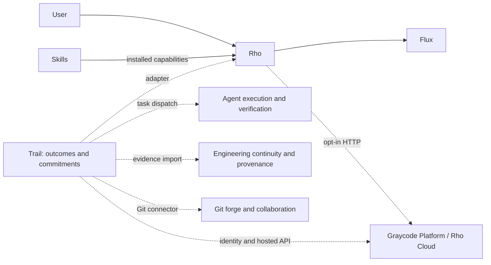

# GraycodeAI workspace map and Trail placement

**Observed:** 2026-09-28  
**Workspace:** `/Users/lakshmanpatel/Desktop/OSS2026/graycode-eco`

## Executive conclusion

Trail should be a **new GraycodeAI product boundary**, but it should reuse the unfinished `radius/` product slot instead of creating an eighth overlapping implementation.

The existing repositories already own model access, coding-agent behavior, execution supervision, engineering provenance, Git collaboration, skills, identity, and a hosted graph ledger. Trail should own the missing layer:

> outcome and commitment coordination across humans, agents, services, repositories, and organizations.

Trail must integrate with the existing products through explicit protocols and adapters. It should not absorb their storage or copy their runtimes.

## Repository inventory

The canonical ecosystem inventory in `rho/ecosystem.yaml` currently recognizes six repositories: Rho, Flux, Graycode Skills, Graycode Platform, Rover, and Across. Trace and Radius exist in this workspace but are not in that manifest.

| Directory | Current role | Maturity | Trail relationship |
|---|---|---|---|
| `rho/` | terminal AI coding agent and orchestration root | large active Go product | execution participant and source of portable session graphs |
| `flux/` | multi-provider LLM runtime | active Go engine used by Rho | remain behind an agent host; Trail should not build another provider layer |
| `graycode-skills/` | skill registry and plugin marketplace | active Python corpus with about 14,000 skills | capability catalog that Trail agents may reference through Rho |
| `graycode-platform/` | company website, browser identity/BFF, optional Rho Cloud control plane | active TypeScript/Cloudflare monorepo | possible identity and hosting integration over HTTP; no source-code dependency |
| `rover/` | agent-neutral worktree execution, DAG supervision, verification, and evidence | public pre-1.0 Go product with an unreleased Rust port | Trail execution provider for bounded software work |
| `across/` | Git-native context, sessions, checkpoints, handoffs, memory, and provenance | unreleased local alpha in Go | Trail evidence and continuity provider for engineering work |
| `trace/` | self-hosted Git forge, collaboration, boards, local CI, agent-session records, and signed mirrors | implemented Go repository, outside the canonical manifest | Trail connector for repositories, issues, changes, reviews, and commits |
| `radius/` | planned human-agent communication, unattended runtime safety, and workspace | no commits, no remote, preimplementation scaffold | best place to replace with Trail rather than preserve a competing workspace |
| `research/` | cross-repository product research | not a Git repository | design record for Trail |

## Current dependency shape



Only Rho has a compile-time dependency on Flux. Graycode Platform is deliberately outside the Go runtime graph. Rover, Across, and Trace are independent products or tools.

## What each repository owns

### Rho owns agent interaction

Rho is the end-user coding agent. It owns conversations, tools, permissions, coding tasks, multi-agent missions, and local session execution. Its portable `rho.graph/v1` projection exports privacy-reduced nodes, edges, lifecycle events, provenance, and evidence references.

Trail should treat Rho as an actor and event producer. Trail should not reproduce Rho's terminal UI, coding tools, permission center, or provider routing.

### Flux owns model-provider communication

Flux owns credentials, provider transports, catalog resolution, streaming, retry, fallback, usage, and provider telemetry. It exposes a narrow engine facade.

Trail should not call provider APIs independently in its first version. Agent execution should enter through Rho, Rover-supervised commands, or another explicit runtime adapter.

### Rover owns bounded execution and verification

Rover owns worktree isolation, approved DAG execution, resource admission, bounded repair attempts, checks, evidence, replay, and candidate integration. It is agent-neutral and explicitly does not publish, merge, or deploy automatically.

Trail may schedule work, but Rover should remain the authority for executing and verifying software tasks.

### Across owns engineering continuity

Across owns sessions, checkpoints, handoffs, context packs, memories, verification provenance, and restoration. Its epistemic labels distinguish observed facts from stated, approved, inferred, disputed, superseded, and unknown claims.

Trail should reference Across evidence instead of copying engineering transcripts or checkpoint storage.

### Trace owns Git collaboration

Trace is already a substantial self-hosted forge. It owns repositories, access grants, branches, pull requests, reviews, issues, releases, project boards, CI workflows, package artifacts, signed mirror synchronization, and bounded agent-session metadata.

Trail should map Trace objects into its coordination graph through a connector. Trace's three-column, issue/PR-only project board is a code-forge view and is not a general work model.

### Graycode Platform owns company web and optional cloud infrastructure

Graycode Platform contains:

- the public website;
- browser identity and the BFF;
- organizations, principals, projects, and devices;
- usage, billing, credits, audit, retention, and delivery;
- an append-only hosted ledger for `rho.graph/v1` projections.

Its repository rules prohibit other Graycode projects from importing it. Any Trail integration must use authenticated HTTP or a deliberately extracted public protocol.

### Radius has no implementation to preserve

Radius currently has no commits or remote. Its staged plan describes channels, threads, tasks, agent assignment, exactly-once inbox delivery, unattended agents, leases, credential brokering, and a Cloudflare control plane.

Those are directly adjacent to Trail. Maintaining both names would create two human-agent workspaces with unclear ownership. The useful Radius work should become Trail requirements:

- bounded authority;
- capability-scoped credentials;
- durable inbox delivery;
- leases and idempotency;
- approval records;
- sandboxed unattended execution.

## Existing assets Trail can reuse

| Asset | Reuse approach |
|---|---|
| `rho.graph/v1` nodes, edges, events, provenance | use as an ingestion envelope, with a Trail semantic mapping |
| Graycode Cloud organization/project/principal model | integrate over HTTP initially; generalize only through an explicit platform change |
| Rover MCP/HTTP control surface | dispatch approved execution and read verified results |
| Across bundles, handoffs, and checkpoint references | ingest references and epistemic status, keeping Across authoritative |
| Trace APIs and signed identities | connect Git work, reviews, and evidence without importing Trace storage |
| Graycode Skills registry | discover capabilities through Rho rather than cloning the registry |
| Radius safety plan | carry its leases, approvals, broker, sandbox, and inbox invariants into Trail |

## Protocol gap

Rho's graph contract is currently inside `rho/internal/contracts/graph`, vendored from a removed repository. Trail cannot safely import a Go `internal` package, and the existing contract is too narrow for the full Trail domain:

- node kinds are broad implementation categories;
- edges are binary;
- work commitments, requests, offers, claims, acceptance, and policy scopes are not first-class;
- temporal validity is present, but supersession and conflict semantics are incomplete;
- multi-party relations need hyperedges or explicit relation nodes.

Trail should define a public, language-neutral protocol with:

1. a small event envelope compatible with the existing provenance fields;
2. stable identifiers and idempotency keys;
3. typed principals, outcomes, commitments, evidence, claims, policies, and relations;
4. valid-time and transaction-time fields;
5. explicit supersession, dispute, acceptance, delegation, and revocation;
6. signed export and selective federation rules.

Rho, Rover, Across, and Trace can then implement adapters without depending on Trail internals.

## Recommended Trail boundary

Trail owns:

- shared outcomes and acceptance criteria;
- requests, offers, commitments, delegations, and renegotiations;
- the typed temporal coordination graph;
- policy-driven authority and escalation;
- evidence links and claims about evidence;
- attention queues for humans and agents;
- dynamic participation measurements;
- federation of selected boundary contracts;
- derived task, board, timeline, graph, and agent-queue views.

Trail does not own:

- LLM transports or model catalogs;
- coding-agent tools and conversations;
- worktree execution or verification engines;
- Git hosting, pull requests, or package registries;
- raw engineering transcripts and checkpoints;
- the company website or general account system.

## Recommended repository decision

Convert the uncommitted `radius/` scaffold into a new `trail/` repository before implementation:

```text
trail/
├── apps/
│   ├── web/             # human and agent coordination workspace
│   ├── api/             # authenticated command/query API
│   └── worker/          # event processing, scheduling, federation
├── packages/
│   ├── protocol/        # public schemas and conformance fixtures
│   ├── domain/          # outcomes, commitments, evidence, policy
│   ├── graph/           # temporal hypergraph projections
│   ├── adapters/        # Rho, Rover, Across, Trace, GitHub
│   └── ui/
├── docs/
└── research/
```

Externally the name is **Trail by GraycodeAI**. Inside the GraycodeAI product family and interface, it is simply **Trail**.

## Inconsistencies to resolve

1. **Website versus current product:** Graycode Platform's live source still presents Hawk, GraycodeRouter, Swift, Shrike, Harrier, Merlin, and Kestrel. Current Rho documentation identifies Rho as the product and Flux as its single engine dependency.
2. **Stale architecture documents:** several diagrams describe repositories that have been removed. `rho/ecosystem.yaml` is the current six-repository inventory.
3. **Trace inventory status:** Trace has a GrayCodeAI remote but is absent from the canonical ecosystem manifest.
4. **Radius identity conflict:** Radius says it is not affiliated with other GraycodeAI work while using Graycode package scopes and GraycodeAI domains. It also has no committed history.
5. **Multiple meanings of project:** Graycode Cloud projects, Across projects, Trace project boards, and Rho missions are separate domain objects. Trail must use explicit adapters rather than treating them as one table.
6. **No public shared graph package:** the useful graph contract is internal to Rho. Trail needs a published protocol before cross-repository coupling grows.
7. **Current worktrees:** Across and Trace contain untracked workflow directories/files; Rho's current branch has no upstream shown. Preserve these states during any restructuring.

## Immediate sequence

1. Decide that Radius is superseded by Trail and preserve any useful plan text.
2. Initialize `trail/` as the product repository with its own AGENTS.md and architecture decision record.
3. Write Trail Protocol v0 before choosing a database or UI.
4. Build a local single-node event journal and materialized outcome/commitment views.
5. Add a read-only Rho graph adapter and one Git provider adapter.
6. Add Rover dispatch only after authority, idempotency, and approval records exist.
7. Add selective federation after local conflict and supersession semantics are proven.

