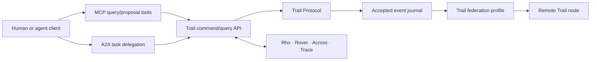

# Protocol and standards map

**Reviewed:** 2026-09-28  
**Status:** selection guide; versions must be pinned when implementation begins

## Protocol layers

Trail should not force one protocol to solve discovery, tools, agent delegation, domain semantics, event transport, federation, provenance, and artifact verification. Each layer has a distinct job.

| Layer | Candidate | Trail use | Does not solve |
|---|---|---|---|
| domain | Trail Protocol | outcomes, commitments, evidence, acceptance, policy references, temporal and conflict semantics | transport, tool discovery, identity proof |
| event envelope | [CloudEvents](https://cloudevents.io/) | common event metadata and bindings | Trail domain invariants and event authorization |
| tools/context | [MCP](https://modelcontextprotocol.io/) | expose narrow queries, proposals, tools, and resources to agent clients | organizational truth, federation, execution acceptance |
| agent delegation | [A2A 1.0.0](https://a2a-protocol.org/v1.0.0/specification/) | discover agents, create/observe long-running tasks, exchange artifacts | work ownership, social commitments, home authority |
| agent/user interaction | [AG-UI](https://github.com/ag-ui-protocol/ag-ui) | experiment with streaming run state, human steering, and frontend interaction | durable outcome semantics, authority, or protocol stability guarantees |
| durable workflows | [Temporal](https://docs.temporal.io/temporal) or a compatible internal abstraction | retry, replay, timers, cancellation, long-running execution | product ontology, cross-domain policy |
| federation transport | [ActivityPub](https://www.w3.org/TR/activitypub/) patterns | addressed inbox/outbox delivery, actor endpoints, subscriptions | signatures, domain-specific consistency, privacy policy |
| forge federation | [ForgeFed](https://forgefed.org/spec) | issues, merge requests, reviews, repositories, grants | general work commitments outside software forges |
| lifecycle interop | [OSLC Core/CM](https://docs.oasis-open.org/oslc-core/README/README-redirect-notice.html) | enterprise change, requirements, quality, and linked-resource integration | agent execution and local-first behavior |
| process exchange | [BPMN 2.0.2](https://www.omg.org/spec/BPMN/) and DMN | import/export of defined processes and decisions | adaptive social commitments or federated authority |
| provenance | [W3C PROV-O](https://www.w3.org/TR/prov-o/) | interchange of agents, activities, entities, derivation, and delegation | artifact integrity or acceptance policy |
| attestations | [in-toto](https://in-toto.io/docs/specs/) / SLSA | signed software supply-chain evidence | general decision evidence and human claims |
| workload identity | [SPIFFE](https://spiffe.io/docs/latest/spiffe-specs/) | short-lived identity for services and hosted agent workers | end-user identity or authorization policy |
| policy decision API | [AuthZEN Authorization API 1.0](https://openid.net/wg/authzen/specifications/) | candidate interoperability boundary between policy decision and enforcement points | Trail policy language, identity proof, or capability lifecycle |
| HTTP/schema contracts | [OpenAPI](https://spec.openapis.org/oas/) and [JSON Schema 2020-12](https://json-schema.org/draft/2020-12) | versioned APIs, validators, generated clients, canonical fixtures | domain invariants and authorization |
| local documents | Automerge or [Yjs](https://docs.yjs.dev/) | convergent collaborative text and selected collections | scarce rights, budgets, revocation, acceptance |
| content address | [CID v1](https://specs.ipfs.tech/cid/) or multihash-compatible digests | stable identity for immutable evidence and artifacts | storage, encryption, retention, access control |
| telemetry | OpenTelemetry | traces, metrics, logs, correlation across adapters | domain audit and non-repudiation |

## Version findings

- **MCP:** the official 2026-07-28 release moved the core toward stateless requests and added an extension framework and Tasks support. Trail must negotiate a pinned version and should treat proposed SEPs as unstable.
- **A2A:** 1.0.0 is the current released specification. Adapter compatibility must still be versioned independently from the Trail domain protocol.
- **ACP:** IBM's Agent Communication Protocol has joined A2A. Do not create a parallel ACP integration unless a specific legacy need appears.
- **AG-UI:** useful emerging protocol for live agent/user interaction; keep it at the adapter layer until stability and product need are demonstrated.
- **AuthZEN:** Authorization API 1.0 became an OpenID Final Specification in January 2026 and should be included in the authorization spike.
- **ActivityPub:** the 2018 W3C Recommendation provides federation mechanics but deliberately does not standardize a complete message-signature mechanism.
- **ForgeFed:** the current public specification is a branch snapshot and contains incomplete vocabulary sections. Use it as a monitored compatibility target, not a dependency for Trail v0.
- **Solid:** the current material includes a Community Group report and newer editor drafts. It is a reference for user-controlled data, not a v0 conformance target.
- **CloudEvents:** use its envelope conventions where compatible, while retaining Trail fields for subject version, causation, policy, home authority, signature, and bitemporal facts.

## Recommended protocol split

MCP and A2A are edge protocols. Trail Protocol is the durable semantic contract. Federation carries a selected subset of accepted domain facts and proposals.

## Identity model

Trail needs distinct identifiers for:

- the human or legal principal accountable for an action;
- an agent identity and its operator;
- the concrete runtime/workload executing a run;
- the device submitting a command;
- the organization or trust domain issuing authority;
- a service connector acting under delegated authority.

One bearer token must not collapse these identities. A run should record the chain of delegation.

Candidate building blocks:

- OIDC/OAuth for interactive identity and delegated API access;
- WebAuthn/passkeys for strong human authentication;
- SPIFFE/SPIRE for workload identity in managed infrastructure;
- Ed25519/P-256 signing keys for node/event signatures, selected after library and compliance review;
- relationship-based authorization for membership and resource access;
- attenuated, short-lived capability tokens for an agent's concrete run.

DIDs and Verifiable Credentials remain optional. Trail should adopt them only for a tested inter-organization identity need, not as a prerequisite for local use.

## Event requirements

Every durable Trail event should carry:

- globally unique event ID;
- schema/specification version;
- event type and subject URI;
- subject version;
- home authority and workspace;
- authenticated actor and delegation chain reference;
- recorded time and, when applicable, valid time interval;
- causation and correlation IDs;
- idempotency key;
- applicable policy version and policy decision reference;
- payload digest and optional signature;
- disclosure classification;
- supersedes/disputes references when relevant.

Transport retries are at least once. Consumers deduplicate by stable event identity and apply events idempotently. External side effects require their own idempotency or compensation contract.

## Federation profile

The v0 federation design should use HTTP and signed addressed envelopes with:

- node discovery and supported-version metadata;
- trust-domain keys and rotation history;
- inbox/outbox delivery with receipts;
- idempotency, replay windows, and quarantine;
- explicit audience and disclosure set;
- request/accept/reject interaction rather than remote direct mutation;
- home-authority version checks;
- tombstone, revocation, dispute, and supersession semantics;
- conformance fixtures before third-party compatibility claims.

ActivityPub vocabulary reuse is optional. The interaction pattern is more valuable initially than JSON-LD expansion complexity.

## Standards deliberately deferred

- blockchain consensus and smart contracts;
- global DIDs as mandatory user identity;
- RDF as the internal persistence model;
- a universal ontology for every work domain;
- full BPMN execution as the core runtime;
- global peer-to-peer replication of private workspaces;
- direct compatibility promises with unstable drafts.

## Conformance strategy

1. Publish JSON Schema and canonical examples.
2. Publish invalid and adversarial fixtures, not only happy paths.
3. Specify semantic invariants separately from serialization.
4. Provide a deterministic reference validator.
5. Test older readers against additive fields and unknown event types.
6. Require capability negotiation for optional extensions.
7. Keep protocol and product release versions independent.
8. Run two independent implementations before calling federation stable.
